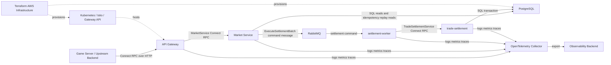

# Context View

## View Metadata

| Field | Value |
| --- | --- |
| View status | Canonical |
| Last reviewed | 2026-06-23 |
| Governing viewpoint | VP-01 Context Viewpoint |
| Evidence baseline | Repository commit `fe5c6af`; architecture file hashes are recorded in `18-evidence-manifest.md` |

Governed by: [VP-01 Context Viewpoint](./02-viewpoints.md#vp-01-context-viewpoint)

## Concerns Addressed

This view addresses CON-01, CON-03, CON-12, CON-16, CON-17, CON-18, and
CON-32.

## System Context Model

Model ID: `MODEL-CTX-01`; view component ID: `VC-CTX-01`.

This model shows the Compose and Kubernetes configuration, where
`SETTLEMENT_TRANSPORT=rabbitmq`. The Market service binary also contains a
direct/connect settlement client used when that transport is configured.

## Legend

| Element | Meaning |
| --- | --- |
| Solid arrow | Runtime request, message, or database interaction |
| Dotted arrow | Deployment or infrastructure relationship |
| `Connect RPC` | Protobuf service over Connect-compatible HTTP |
| `RabbitMQ` | Asynchronous settlement command/reply broker |
| `PostgreSQL` | Durable source of truth |

## Boundary Model

Model ID: `MODEL-CTX-02`; view component ID: `VC-CTX-02`.

| Boundary | Inside | Outside | Control intent | Related aspect | Evidence level |
| --- | --- | --- | --- | --- | --- |
| BND-01 Game-facing API boundary | API Gateway | Game server and upstream callers | API Gateway is the only public service in the checked-in local and production-like manifests. | ASP-05 | E2 |
| BND-02 Trade policy boundary | Market | API Gateway and settlement execution | Market performs trade-mechanic validation and composes settlement operation batches. | ASP-01, ASP-05 | E2 |
| BND-03 Async settlement boundary | RabbitMQ and settlement-worker | Market and trade-settlement | In Compose and Kubernetes, Market publishes commands to the broker and settlement-worker calls trade-settlement. | ASP-04 | E2 |
| BND-04 Settlement execution boundary | trade-settlement | Market, worker, and callers | trade-settlement atomically executes requested operation batches and writes idempotency/settlement metadata. | ASP-03, ASP-05 | E2 |
| BND-05 Data boundary | PostgreSQL | All services | PostgreSQL holds authoritative state and settlement audit metadata. | ASP-03, ASP-08 | E2 |
| BND-06 Operations boundary | Kubernetes, Terraform, observability assets | Runtime business services | Deployment configuration constrains runtime connectivity and visibility. | ASP-06, ASP-07 | E2 |

## Interface Catalog

Model ID: `MODEL-CTX-03`; view component ID: `VC-CTX-03`.

| Interface | Provider | Consumer | Contract source | Purpose | Evidence anchor |
| --- | --- | --- | --- | --- | --- |
| `GameTradeGatewayService.IssueTradeInstance` | API Gateway | Game server | `distributed-backend/proto/eve/api_gateway/v1/api_gateway.proto` | Game-facing request to create a trade instance. | EVID-001 |
| `GameTradeGatewayService.AcceptTradeInstance` | API Gateway | Game server | `distributed-backend/proto/eve/api_gateway/v1/api_gateway.proto` | Game-facing request to accept an open trade instance. | EVID-001 |
| `GameTradeGatewayService.CancelTradeInstance` | API Gateway | Game server | `distributed-backend/proto/eve/api_gateway/v1/api_gateway.proto` | Game-facing request to cancel an open trade instance. | EVID-001 |
| `MarketService.*` | Market | API Gateway | `distributed-backend/proto/eve/market/v1/market.proto` | Internal trade command validation and settlement planning. | EVID-002 |
| `ExecuteSettlementBatch` message | RabbitMQ topology | Market, settlement-worker | `distributed-backend/proto/eve/trade_settlement/v1/trade_settlement.proto` and `distributed-backend/src/messaging/rabbitmqsettlement` | Brokered settlement command and reply path. | EVID-003, EVID-009 |
| `TradeSettlementService.ExecuteSettlementBatch` | trade-settlement | settlement-worker in RabbitMQ deployments; Market when direct/connect transport is configured | `distributed-backend/proto/eve/trade_settlement/v1/trade_settlement.proto` | Atomically executes requested settlement operations in PostgreSQL. | EVID-003 |
| SQL connections | PostgreSQL | Market, trade-settlement, migration job | Migrations under `distributed-backend/src/trade-settlement/migrations` | Read snapshots, run migrations, and apply mutations. | EVID-010 |
| `/healthz` and `/readyz` | Services | Compose, Kubernetes, operators | Service server implementations and manifests | Liveness/readiness reporting. | EVID-012, EVID-013 |
| OpenTelemetry export | Services and collector | Observability backend | `distributed-backend/OBSERVABILITY.md` and manifests | Distributed observability. | EVID-020 |

## Protocol And Path Catalog

| Flow | Protocol and path | Port/config evidence | Notes |
| --- | --- | --- | --- |
| Game server to API Gateway issue | Connect POST `/eve.api_gateway.v1.GameTradeGatewayService/IssueTradeInstance` | API Gateway listens on `:8080` via `API_GATEWAY_HTTP_ADDR`. | External method reuses Market request/response message types. |
| Game server to API Gateway accept | Connect POST `/eve.api_gateway.v1.GameTradeGatewayService/AcceptTradeInstance` | API Gateway listens on `:8080`. | Actor identity must be bound to authenticated claims before production exposure. |
| Game server to API Gateway cancel | Connect POST `/eve.api_gateway.v1.GameTradeGatewayService/CancelTradeInstance` | API Gateway listens on `:8080`. | Same idempotency rules as other trade commands. |
| API Gateway to Market | Connect POST `/eve.market.v1.MarketService/{IssueTradeInstance,AcceptTradeInstance,CancelTradeInstance}` | `MARKET_URL=http://market:8081` in Kubernetes base config. | API Gateway readiness checks Market `/readyz`. |
| Market to RabbitMQ | AMQP publish to exchange `eve.trade.settlement` with routing key `settlement.execute` | Kubernetes base config, Compose, and messaging defaults. | Used when `SETTLEMENT_TRANSPORT=rabbitmq`; this is the checked-in Compose/Kubernetes path. |
| Market direct to trade-settlement | Connect POST `/eve.trade_settlement.v1.TradeSettlementService/ExecuteSettlementBatch` | Market code supports explicit `connect`, `grpc`, or `direct` transport and uses `TRADE_SETTLEMENT_URL` for that path. The default fallback is `rabbitmq`. | Implemented alternate transport; not the checked-in Compose/Kubernetes path. |
| settlement-worker to trade-settlement | Connect POST `/eve.trade_settlement.v1.TradeSettlementService/ExecuteSettlementBatch` | `TRADE_SETTLEMENT_URL=http://trade-settlement:9092`. | Internal privileged API in the RabbitMQ path. |
| Market and trade-settlement to PostgreSQL | PostgreSQL wire protocol | `DATABASE_URL` secret or local Compose env. | Market reads; trade-settlement writes. |

## External Dependencies

| Dependency | Used by | Current role |
| --- | --- | --- |
| PostgreSQL | Market, trade-settlement, migration job | Source of truth and transaction manager. |
| RabbitMQ | Market, settlement-worker | Settlement command/reply broker. |
| Kubernetes | Production-like runtime | Schedules services and applies probes, configuration, secrets, and network policies. |
| Istio and Gateway API | Production-like runtime | Ingress, traffic policy, and service security resources. |
| OpenTelemetry collector | Services | Telemetry collection and export. |
| AWS infrastructure | Production-like runtime | VPC, EKS, RDS, image repositories, and related resources through Terraform. |

## Context View Assertions

| Assertion | Enforcement tag | Evidence |
| --- | --- | --- |
| API Gateway has no durable data ownership; it forwards game-facing trade commands to Market. | Enforced by code | API Gateway handlers call the Market client and no database repository is modeled for API Gateway. |
| Market owns game-rule decisions for issue, accept, and cancel requests. | Enforced by code | Market handlers and `game-trade` package perform validation and settlement planning. |
| trade-settlement atomically executes requested settlement operations and metadata writes. | Enforced by code | Rust settlement executor owns the transaction, savepoint, operation dispatch, idempotency, and settlement-step metadata writes. |
| RabbitMQ is part of the checked-in Compose and Kubernetes trade command path. | Enforced by configuration | Compose and Kubernetes set `SETTLEMENT_TRANSPORT=rabbitmq`; Market config also defaults to `rabbitmq`; code still supports explicit direct/connect transport for local or alternate deployment. |
| PostgreSQL is shared by Market for reads and trade-settlement for writes. | Enforced by code | Market repository is read-oriented; trade-settlement applies SQL mutations. |
| Observability spans all services. | Partially enforced | OTEL configuration exists; complete dashboards and alert rules are tracked as risks. |

## Concern Satisfaction

| Concern | How this view satisfies it | Evidence or gap |
| --- | --- | --- |
| CON-01 | Lists all public trade commands and API paths. | Protobuf contracts under `distributed-backend/proto/eve`. |
| CON-03 | Identifies providers and consumers for response-bearing interfaces. | Interface Catalog. |
| CON-12 | Identifies health/readiness interfaces and downstream dependencies. | Detailed probe semantics are in Deployment and Operations. |
| CON-16 | Shows the same logical service chain for local and Kubernetes contexts. | Compose and Kubernetes artifacts. |
| CON-17 | Separates game-facing API boundary from internal settlement boundary. | Boundary Model. |
| CON-18 | Identifies network and trust boundaries that must be enforced by deployment policy. | Deployment and Security views provide enforcement details. |
| CON-32 | Shows telemetry export path and cross-service flow. | Observability view defines required signals. |

## Aspect Application

| Aspect | Context element |
| --- | --- |
| ASP-01 Contract compatibility | Protobuf service contracts and shared message types. |
| ASP-04 Asynchronous settlement | RabbitMQ plus settlement-worker boundary. |
| ASP-05 Trust boundary control | BND-01 through BND-06. |
| ASP-07 Observability | OpenTelemetry collector and telemetry export relationships. |
