# Context View

## View Metadata

| Field | Value |
| --- | --- |
| View status | Canonical current state |
| Last reviewed | 2026-06-25 |
| Governing viewpoint | VP-01 Context Viewpoint |
| Evidence baseline | v6 architecture cleanup; starting commit recorded in `changes/v6/changes.md` |

Governed by: [VP-01 Context Viewpoint](./02-viewpoints.md#vp-01-context-viewpoint)

## Concerns Addressed

This view addresses the game frontend/player interaction boundary, low-latency
UDP edge behavior, Market domain interpretation, settlement correctness,
platform operations, security/replay/idempotency, and CI/CD enforcement.

## System Context Model

Model ID: `MODEL-CTX-01`; view component ID: `VC-CTX-01`.

The current production runtime path is:

`game frontend -> Quilkin UDP -> API gateway UDP edge -> Market GUI interaction -> settlement operations -> trade-settlement`

```mermaid
flowchart LR
  Frontend["Real game frontend or local simulator"] -->|signed production GUI UDP packet| Quilkin["Quilkin UDP"]
  Quilkin -->|UDP forward| Gateway["API Gateway UDP edge"]
  Gateway -->|SubmitTradeGuiInteraction raw_payload only| Market["Market"]
  Market -->|SQL reads and replay lookup| Postgres["PostgreSQL"]
  Market -->|low-level settlement batch command| Rabbit["RabbitMQ"]
  Rabbit -->|settlement command| Worker["settlement-worker"]
  Worker -->|ExecuteSettlementBatch| Settlement["trade-settlement"]
  Settlement -->|atomic SQL transaction| Postgres

  Gateway -->|logs metrics traces| OTel["OpenTelemetry Collector"]
  Market -->|logs metrics traces| OTel
  Worker -->|logs metrics traces| OTel
  Settlement -->|logs metrics traces| OTel
  OTel -->|export| Obs["Observability Backend"]

  K8s["Kubernetes / Istio / NetworkPolicy"] -. constrains .-> Quilkin
  K8s -. constrains .-> Gateway
  K8s -. constrains .-> Market
  Terraform["Terraform platform roots"] -. provisions/prepares .-> K8s
  Terraform -. provisions .-> Postgres
```

## Boundary Model

Model ID: `MODEL-CTX-02`; view component ID: `VC-CTX-02`.

| Boundary | Inside | Outside | Current control intent | Evidence level |
| --- | --- | --- | --- | --- |
| Game packet boundary | Real frontend packet shape, simulator outbound payload | Simulator local UI/database/log implementation | The local simulator sends the same production-shaped GUI packet a real frontend would send; no Django/browser/test/simulator identity leaves the process. | Enforced by `simulator/trade_gui/tests.py` |
| UDP routing boundary | Quilkin UDP | Public/client network | Quilkin owns UDP proxy/routing behavior and forwards to API Gateway UDP. | Enforced by Compose and Kubernetes manifests |
| UDP edge boundary | API Gateway UDP listener | Quilkin and clients | API Gateway validates transport safety, HMAC integrity, rate/replay limits, queue capacity, and downstream timeout. It does not decide issue/accept/cancel. | Enforced by `quilkin_udp.go` and tests |
| Business interpretation boundary | Market | API Gateway and settlement execution | Market owns GUI action interpretation, game-trade validation, and conversion into settlement operations. | Enforced by Market handler and proto |
| Settlement execution boundary | trade-settlement | Market, worker, and callers | trade-settlement executes only low-level settlement operation batches and infrastructure idempotency/audit metadata. | Enforced by settlement proto/Rust executor |
| Data boundary | PostgreSQL | All services | PostgreSQL holds authoritative state, settlement metadata, idempotency records, and ledgers. | Enforced by migrations and repositories |
| Operations boundary | Kubernetes/Terraform/CI | Runtime services | Production overlays exclude local simulator resources and CI validates manifests and architecture boundaries. | Enforced by workflow and guard script |

## Interface Catalog

Model ID: `MODEL-CTX-03`; view component ID: `VC-CTX-03`.

| Interface | Provider | Consumer | Contract source | Purpose |
| --- | --- | --- | --- | --- |
| Signed `eve-trade-edge.v1` UDP envelope | Game frontend or local simulator | Quilkin/API Gateway | `simulator/trade_gui/udp_client.py`, `distributed-backend/src/api-gateway/distributed-backend/quilkin_udp.go` | Carries authenticated raw GUI payload without simulator/test identity. |
| `eve-trade-gui.v1` GUI payload | Game frontend or local simulator | Market through API Gateway | `simulator/trade_gui/views.py`, Market GUI handler structs | Represents UI window/action/control and player-provided trade inputs. |
| `MarketService.SubmitTradeGuiInteraction` | Market | API Gateway | `distributed-backend/proto/eve/market/v1/market.proto` | Receives only `bytes raw_payload`; Market interprets the game GUI interaction. |
| `ExecuteSettlementBatch` message | RabbitMQ topology | Market, settlement-worker | `distributed-backend/proto/eve/trade_settlement/v1/trade_settlement.proto`, `distributed-backend/src/messaging/rabbitmqsettlement` | Brokered low-level settlement command and reply path. |
| `TradeSettlementService.ExecuteSettlementBatch` | trade-settlement | settlement-worker in RabbitMQ deployments; Market only when explicitly configured for direct/connect transport | `distributed-backend/proto/eve/trade_settlement/v1/trade_settlement.proto` | Atomically executes requested settlement operations in PostgreSQL. |
| SQL connections | PostgreSQL | Market, trade-settlement, migration job | `distributed-backend/src/trade-settlement/migrations` | Market reads snapshots; trade-settlement applies mutations. |
| `/healthz` and `/readyz` | API Gateway, Market, settlement-worker, trade-settlement | Compose, Kubernetes, operators | Service implementations and manifests | Liveness/readiness reporting. |
| OpenTelemetry export | Services and collector | Observability backend | `distributed-backend/OBSERVABILITY.md` and manifests | Distributed observability without logging full player payloads. |

## Protocol And Path Catalog

| Flow | Protocol and path | Port/config evidence | Notes |
| --- | --- | --- | --- |
| Game frontend to Quilkin | UDP signed edge envelope | Compose/Kubernetes expose Quilkin UDP `26001`. | Simulator and real frontend use the same payload shape. |
| Quilkin to API Gateway | UDP forward | API Gateway listens on UDP `26000` via `API_GATEWAY_QUILKIN_UDP_ADDR`. | NetworkPolicy allows Quilkin to API Gateway UDP in production overlay. |
| API Gateway to Market | Connect POST `/eve.market.v1.MarketService/SubmitTradeGuiInteraction` | `MARKET_URL=http://market:8081` in config. | Request contains only `raw_payload`; source transport/address are not part of the business contract. |
| Market to RabbitMQ | AMQP publish to exchange `eve.trade.settlement` with routing key `settlement.execute` | Kubernetes base config, Compose, and messaging defaults. | Checked-in Compose/Kubernetes settlement path. |
| settlement-worker to trade-settlement | Connect/gRPC-compatible call to `ExecuteSettlementBatch` | `TRADE_SETTLEMENT_URL=http://trade-settlement:9092`. | Internal privileged settlement API. |
| Market and trade-settlement to PostgreSQL | PostgreSQL wire protocol | `DATABASE_URL` secret or local Compose env. | Market reads; trade-settlement writes. |

## Context View Assertions

| Assertion | Enforcement tag | Evidence |
| --- | --- | --- |
| API Gateway exposes no production direct issue, accept, or cancel trade RPCs. | Enforced by deletion and CI guard | API Gateway proto and generated service files are deleted; `scripts/verify_architecture_boundaries.py` rejects drift. |
| Market exposes one production GUI submission RPC. | Enforced by proto | `MarketService.SubmitTradeGuiInteraction` request contains only `bytes raw_payload`. |
| API Gateway forwards raw GUI payload to Market and keeps gateway source metadata internal. | Enforced by tests | `TestQuilkinUDPServerForwardsOnlyRawPayloadToMarket`. |
| Market owns game trade interpretation. | Enforced by code | Market maps GUI actions to private issue/accept/cancel helpers and settlement plans. |
| trade-settlement receives low-level settlement operations only. | Enforced by proto and Rust command conversion | Settlement proto contains operation batches, not game trade mechanics. |
| Production overlays do not include simulator resources. | Enforced by CI guard and kustomize render | Production `kustomization.yaml` includes Quilkin but not simulator. |

## External Dependencies

| Dependency | Used by | Current role |
| --- | --- | --- |
| PostgreSQL | Market, trade-settlement, migration job | Source of truth and transaction manager. |
| RabbitMQ | Market, settlement-worker | Settlement command/reply broker. |
| Quilkin | Game UDP path | UDP proxy/routing edge in local and production overlays. |
| Kubernetes | Production-like runtime | Schedules services and applies probes, configuration, secrets, and network policies. |
| Istio | Production-like internal service mesh controls | mTLS and service authorization for internal HTTP/gRPC paths. |
| OpenTelemetry collector | Services | Telemetry collection and export. |
| Terraform platform roots | Operators | AWS, GCP, or Talos/Omni platform preparation. |

## Current Limitations

| Limitation | Current status |
| --- | --- |
| HMAC authenticates packet integrity but does not bind account identity to capsuleer IDs. | Future work; documented in security and risk views. |
| API Gateway replay cache is in-memory per process. | Acceptable for local slice; production multi-replica replay/idempotency relies on Market/settlement durable idempotency for business effects. |
| Market still contains private Go issue/accept/cancel helper functions. | Intentional internal implementation detail; not public production RPC surface. |
| Full production Quilkin configuration depends on operator-supplied image digests/secrets. | Production overlay renders and validates but uses placeholder image digests until CI release injection. |
