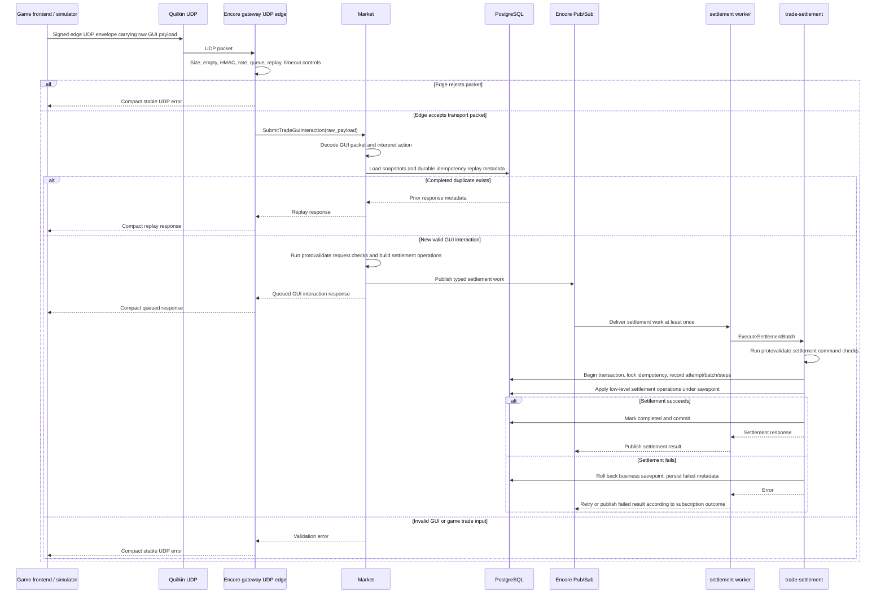

# Functional and Runtime View

## View Metadata

| Field | Value |
| --- | --- |
| View status | Canonical current state |
| Last reviewed | 2026-07-08 |
| Governing viewpoints | VP-02 Functional Decomposition, VP-03 Runtime Transaction |
| Evidence baseline | v9 experimental refactor; branch delta recorded in `changes/v9/changes.md` |

Governed by:

- [VP-02 Functional Decomposition Viewpoint](./02-viewpoints.md#vp-02-functional-decomposition-viewpoint)
- [VP-03 Runtime Transaction Viewpoint](./02-viewpoints.md#vp-03-runtime-transaction-viewpoint)

## Functional Decomposition

| Component | Primary responsibilities | Must not own |
| --- | --- | --- |
| Game frontend or local simulator | Build a production-shaped `eve-trade-gui.v1` GUI interaction packet and sign its schema, algorithm, key ID, and canonical payload in an `eve-trade-edge.v2` UDP envelope. | Backend trade decisioning, gateway metadata, simulator/framework identity in outbound packets. |
| Quilkin | UDP proxy/routing edge between frontend traffic and Encore gateway UDP. | Game trade parsing, settlement planning, database mutation. |
| Encore gateway | UDP edge safety, HMAC integrity, packet-size and empty-packet rejection, bounded worker/queue handling, per-remote rate limiting, replay rejection, downstream timeout, compact UDP responses, logs/metrics/traces, raw-payload forwarding to Market. | Business interpretation of GUI packets, issue/accept/cancel decisioning, source metadata in Market requests, durable mutation. |
| Market | Interpret GUI window/action/control and player input, call protovalidate-backed game-trade input validation, perform durable idempotency/replay checks, read current item/wallet/trade snapshots, compose low-level settlement operation batches, and publish typed settlement work. | UDP edge behavior, gateway-specific metadata handling, direct durable mutation of trade/wallet/item/ledger state. |
| Encore Pub/Sub settlement messaging | Provides typed at-least-once delivery for settlement work and result visibility topics. | Business validation or database mutation. |
| settlement worker | Handles the Encore Pub/Sub settlement-work subscription, calls trade-settlement, publishes settlement results, and exposes health/readiness through the Encore app. | Trade policy decisions or direct database mutation. |
| trade-settlement | Validate settlement protobuf requests through protovalidate, convert protobuf strings/timestamps into Rust command values, enforce idempotency, atomically execute requested low-level settlement operations in one PostgreSQL transaction, record settlement metadata, and enforce row-level preconditions. | Game-facing API behavior, GUI interpretation, source mechanic knowledge, upstream authorization policy. |
| PostgreSQL | Persist authoritative state, constraints, ledger rows, idempotency records, settlement batches, attempts, and steps. | Runtime process orchestration. |

## GUI Action Mapping

Market currently maps stable game UI actions to private helper functions. These
helpers are not public production RPCs.

| GUI action | Market private decision path | Settlement outcome |
| --- | --- | --- |
| `market_place_sell_order` | Private issue-trade helper after GUI input decoding and snapshot validation. | Create trade, create item escrow, decrement seller source stack, append item ledger rows. |
| `market_buy_from_sell_order` | Private accept-trade helper after GUI input decoding and snapshot validation. | Move accepted item quantity to buyer destination, transfer ISK through wallet escrow to seller, update trade remaining quantity/state, append item and wallet ledgers. |
| `market_cancel_order` | Private cancel-trade helper after GUI input decoding and snapshot validation. | Return remaining item escrow to seller stack, close/cancel trade, append item ledger rows. |

Future GUI actions must enter through `SubmitTradeGuiInteraction` and keep the
same boundary: Market interprets game mechanics, settlement receives only
low-level operations.

## Validation Ownership Model

| Validation category | Primary owner | Current implementation |
| --- | --- | --- |
| Reusable scalar/request rules | Protobuf | `proto/eve/validation/v1/validation_rules.proto` defines reusable `non_blank_string`, UUID, positive `int64`, trade-kind, trade-state, and trade-state-change rules. |
| Game-trade input shape | Protobuf plus Go protovalidate call | `proto/eve/trade/v1/trade.proto` defines issue, accept, and cancel input rules; `internal/gametrade/validation.go` adapts existing Go structs to generated proto messages and calls protovalidate. |
| Settlement command shape | Protobuf plus Go/Rust protovalidate calls | `proto/eve/trade_settlement/v1/trade_settlement.proto` defines envelope, oneof, operation, ID, quantity, timestamp, and merge distinctness rules; `settlementworker/convert.go` and Rust `ExecuteBatchCommand::try_from` call protovalidate. |
| Transport and packet safety | Go | UDP packet size, HMAC, replay, rate limit, queue, and GUI JSON parsing are not protobuf payload validation and remain in `gateway` and `market`. |
| Current-state business preconditions | Go/Rust plus SQL | Ownership, active/open state, balance/quantity availability, escrow release, and ledger/projection invariants depend on current PostgreSQL rows and remain in Market, trade-settlement operation handlers, and SQL constraints/triggers. |

## Runtime Sequence Model

Model ID: `MODEL-RUN-01`; view component ID: `VC-RUN-01`.

## Edge Behavior Matrix

| Condition | Owner | Current behavior |
| --- | --- | --- |
| Packet exceeds max size | Encore gateway | Reject before worker queue and return `packet_too_large`. |
| Empty packet | Encore gateway | Reject and return `empty_packet`. |
| Missing/invalid HMAC when auth required | Encore gateway | Reject and return `missing_signature` or `invalid_signature`. |
| Per-remote rate limit exceeded | Encore gateway | Reject before worker queue and return `rate_limited`. |
| Worker queue full | Encore gateway | Drop/reject and return `queue_full`. |
| Duplicate interaction ID seen by edge cache | Encore gateway | Reject before Market call and return `replay`. |
| Downstream Market timeout or unavailable | Encore gateway | Return compact stable error without stack traces or framework details. |
| Valid packet accepted by Market | Encore gateway | Return compact JSON Market response over UDP. |

## Settlement Effects

| Market decision | Low-level settlement operation categories | Durable owner |
| --- | --- | --- |
| Issue sell order | Trade row creation, item escrow creation, source item stack decrement, item ledger append, settlement metadata/idempotency completion. | trade-settlement/PostgreSQL |
| Accept sell order | Buyer item stack creation or transfer, item escrow transfer, wallet escrow creation, buyer wallet debit, seller wallet credit, trade remaining quantity/state update, wallet and item ledger append, settlement metadata/idempotency completion. | trade-settlement/PostgreSQL |
| Cancel sell order | Trade state update, item escrow return to seller stack, item ledger append, settlement metadata/idempotency completion. | trade-settlement/PostgreSQL |

trade-settlement receives these as operation batches. It does not receive
game-mechanic RPCs and does not know whether a batch came from a GUI button,
market order, contract, direct trade, browser, simulator, or any other gameplay
mechanic.

## Idempotency And Replay

| Layer | Mechanism | Scope |
| --- | --- | --- |
| Encore gateway | In-memory replay cache keyed by `interaction_id` with configurable TTL. | Edge abuse protection; avoids immediate duplicate forwarding within one gateway process. |
| Market | Requires `interaction_id` in the GUI packet and maps default idempotency/external request IDs from the packet/input; checks completed replay state. | Business replay safety before settlement planning. |
| trade-settlement | Durable idempotency record and request fingerprint tied to settlement batch execution. | Prevents duplicate durable settlement effects for the same idempotency key/fingerprint. |

The edge replay cache is not the only correctness guard. Duplicate packets must
not double-settle because Market and trade-settlement enforce durable
idempotency in the settlement path.

## Timeout Budget

| Segment | Config or evidence | Current value | Status |
| --- | --- | --- | --- |
| gateway downstream call to Market | `API_GATEWAY_DOWNSTREAM_TIMEOUT` default | `5s` | Evidence-backed |
| Market settlement publication | Encore Pub/Sub publish through `settlement.WorkTopic` | Runtime-managed | Evidence-backed |
| Encore Pub/Sub subscription retry | `settlementworker` subscription config | Max 12 retries, 30s ack deadline, concurrency 8 | Evidence-backed |
| settlement worker to trade-settlement | `SETTLEMENT_WORKER_REQUEST_TIMEOUT` in Kubernetes base config | `10s` | Evidence-backed |
| Database transaction/lock budget | PostgreSQL/session config | Not specified in repository | Current limitation |

## Response Contract

Encore gateway UDP responses are compact JSON/protojson payloads. Error responses
use stable `code` values and short messages. They must not expose stack traces,
framework names, simulator identity, raw player payloads, or internal transport
metadata.

## Current Limitations

| Limitation | Status |
| --- | --- |
| Edge replay cache is process-local. | Durable double-settlement protection remains in Market/trade-settlement; distributed edge replay would require shared cache or routed affinity. |
| Account-to-capsuleer authentication is not implemented. | HMAC protects packet integrity only; identity binding remains future work. |
| Market GUI payload parser currently handles the implemented local market actions. | Future game UI actions require Market-owned parser/decision extensions and tests. |
| No separate public outcome lookup API exists. | Ambiguous timeout recovery relies on same-idempotency replay and settlement metadata inspection. |
