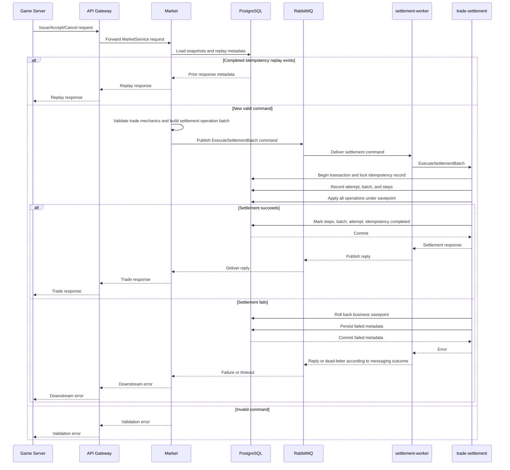
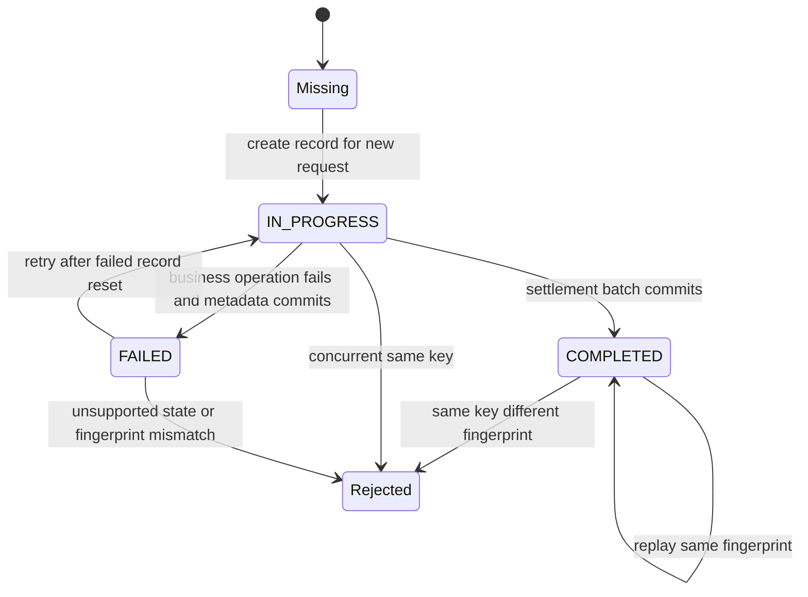

# Functional and Runtime View

## View Metadata

| Field | Value |
| --- | --- |
| View status | Canonical |
| Last reviewed | 2026-06-23 |
| Governing viewpoints | VP-02 Functional Decomposition, VP-03 Runtime Transaction |
| Evidence baseline | Repository commit `fe5c6af`; architecture file hashes are recorded in `18-evidence-manifest.md` |

Governed by:

- [VP-02 Functional Decomposition Viewpoint](./02-viewpoints.md#vp-02-functional-decomposition-viewpoint)
- [VP-03 Runtime Transaction Viewpoint](./02-viewpoints.md#vp-03-runtime-transaction-viewpoint)

## Concerns Addressed

This view addresses CON-01, CON-02, CON-03, CON-04, CON-05, CON-06, CON-07,
CON-10, CON-12, CON-13, CON-14, CON-15, CON-28, CON-29, CON-32, and CON-33.

## Functional Decomposition

| Component | Primary responsibilities | Must not own |
| --- | --- | --- |
| API Gateway | Expose game-facing protobuf service, accept issue/accept/cancel requests, forward to Market, preserve downstream errors where possible, expose health/readiness. | Game-rule validation, settlement operation construction, durable mutation. |
| Market | Load current item, wallet, trade, and idempotency snapshots; validate issue/accept/cancel trade mechanics; compute settlement operation batches; call the configured settlement executor; return settlement identifiers and trade identifiers. | Direct mutation of trade, wallet, item, escrow, or ledger state. |
| RabbitMQ settlement messaging | Declare/use settlement exchange, command queue, reply handling, dead-letter queue, and request/reply headers. | Business validation or database mutation. |
| settlement-worker | Consume settlement command messages, call trade-settlement, publish settlement replies, expose health/readiness tied to worker dependencies. | Trade policy decisions or direct database mutation. |
| trade-settlement | Validate settlement batch envelope, enforce idempotency, atomically execute requested settlement operations in one PostgreSQL transaction, record settlement metadata, and perform row-level precondition checks in SQL/Rust handlers. | Game-facing API behavior, Market trade policy, or upstream authorization policy. |
| PostgreSQL | Persist authoritative state, constraints, ledger rows, idempotency records, settlement batches, attempts, and steps. | Runtime process orchestration. |

## Command Catalog

| Command | Public entry point | Market validation focus | Settlement outcome |
| --- | --- | --- | --- |
| Issue trade instance | `GameTradeGatewayService.IssueTradeInstance` | Seller and item stack ownership, item stack availability, requested quantity, price, idempotency replay. | Market requests operations that create trade and item escrow records, decrement the source item stack, and append hash-chained item ledger effects. |
| Accept trade instance | `GameTradeGatewayService.AcceptTradeInstance` | Trade open and not expired, buyer wallet ownership and balance, seller wallet active, destination stack compatibility, idempotency replay. | Market requests operations that move accepted quantity to buyer, transfer ISK from buyer wallet through escrow to seller wallet, update remaining quantity through escrow transfer, optionally complete the trade, and append ledgers. Destination stack creation also appends an initial `CREATE_STACK` item ledger row. |
| Cancel trade instance | `GameTradeGatewayService.CancelTradeInstance` | Issuer is permitted to cancel, trade open, idempotency replay. | Market requests operations that return remaining item escrow to seller, cancel the trade, and append hash-chained item ledger effects. |

## Runtime Sequence Model

Model ID: `MODEL-RUN-01`; view component ID: `VC-RUN-01`.

This sequence shows the checked-in Compose and Kubernetes configuration, where
Market uses the RabbitMQ settlement transport. The Market binary also supports a
direct/connect settlement executor when configured outside this path.

## Issue Runtime Effects

| Step | Owner | Effect |
| --- | --- | --- |
| Load item stack | Market | Confirms seller ownership, item type, location, quantity, and active state. |
| Build settlement operations | Market | Creates a batch containing trade creation and item escrow operations. |
| Execute batch | trade-settlement | Executes the requested operations atomically: inserts trade and escrow records, decreases source item stack, appends ledger rows, completes idempotency metadata. |
| Return response | Market/API Gateway | Returns identifiers such as trade instance and settlement batch. |

## Accept Runtime Effects

| Step | Owner | Effect |
| --- | --- | --- |
| Load trade and wallets | Market | Confirms open state, remaining quantity, expiration, buyer wallet, seller wallet, and balance. |
| Validate destination stack | Market | Confirms owner, item type, station, and compatibility when a destination stack is supplied. |
| Build settlement operations | Market | Creates a batch that moves item escrow and wallet value according to accepted quantity and price. |
| Execute batch | trade-settlement | Executes the requested operations atomically: updates remaining quantity through escrow transfer, optionally changes trade state, updates item stack quantities, wallet balances, escrow records, and appends ledgers. |
| Return response | Market/API Gateway | Returns settlement batch and updated trade identifiers. |

## Cancel Runtime Effects

| Step | Owner | Effect |
| --- | --- | --- |
| Load trade | Market | Confirms the trade exists, is open, and is cancelable by the actor. |
| Build settlement operations | Market | Creates a batch that returns remaining item escrow and cancels/closes the trade. |
| Execute batch | trade-settlement | Executes the requested operations atomically: updates trade state, returns item quantity, closes escrow, appends ledgers, and completes metadata. |
| Return response | Market/API Gateway | Returns settlement batch and cancellation identifiers. |

## Idempotency Behavior

| Scenario | Expected behavior |
| --- | --- |
| Completed request replayed with same key and compatible fingerprint | Return the previous completed outcome without duplicating business mutations. |
| Request with same key is already in progress | Reject or fail as a conflict so concurrent mutation cannot duplicate. |
| Prior request failed | trade-settlement can reset failed idempotency state and attempt execution again according to implementation behavior. |
| Missing or malformed idempotency data | Rejected by service validation or treated as an invalid command envelope. |

## Idempotency State Model

Model ID: `MODEL-RUN-02`; view component ID: `VC-RUN-02`.

| State | Durable meaning | Caller/operator interpretation |
| --- | --- | --- |
| Missing | No settlement record exists for the idempotency key. | Treat as new request if validation passes. |
| `IN_PROGRESS` | A request with this key is executing or was interrupted before completion status changed. | Do not retry blindly; query/replay later or use operational reconciliation. |
| `COMPLETED` | Business mutation and settlement metadata committed. | Replay returns previous outcome for the same fingerprint. |
| `FAILED` | Business mutation was rolled back and failed metadata committed. | Retrying may reset failed state; inspect failure metadata first for repeated failures. |
| Fingerprint mismatch | Key was reused for different request material. | Reject; caller must use a new idempotency key. |

## Timeout Budget

The current timeout values are facts, not an approved end-to-end contract. The
facts catalog records that the current hierarchy is inconsistent for a strictly
synchronous caller contract.

| Segment | Config or evidence | Current value | Status | Architecture note |
| --- | --- | --- | --- | --- |
| Game caller to API Gateway | External caller contract | Not specified in repository | Gap recorded | No repository-level caller timeout contract is defined. |
| API Gateway to Market | `API_GATEWAY_DOWNSTREAM_TIMEOUT` default | `5s` | Evidence-backed | Applies to API Gateway downstream Market calls; currently shorter than Market settlement wait. |
| Market settlement wait | `MARKET_SETTLEMENT_REQUEST_TIMEOUT` default | `10s` | Evidence-backed | Applies to direct/connect or RabbitMQ settlement executor calls. |
| RabbitMQ publish | `RABBITMQ_PUBLISH_TIMEOUT` in Kubernetes base config | `5s` | Evidence-backed | Applies to settlement command/reply publish operations. |
| settlement-worker to trade-settlement | `SETTLEMENT_WORKER_REQUEST_TIMEOUT` in Kubernetes base config | `10s` | Evidence-backed | Applies to worker RPC calls to trade-settlement. |
| Database transaction | PostgreSQL/session config | Not specified in repository | Gap recorded | No explicit database statement or lock timeout is modeled. |

The repository does not currently implement a separate outcome-retrieval API or
a documented caller timeout contract.

## RabbitMQ Command And Reply Semantics

| Scenario | Expected command handling | Caller-visible effect | Operational note |
| --- | --- | --- | --- |
| Publish succeeds and reply succeeds | Market receives a settlement reply and returns success or settlement error. | Determinate success or failure. | Normal path. |
| Command publish fails before broker acceptance | Market returns downstream error. | No accepted settlement command is known. | Retry with same idempotency key is expected to be safe. |
| Worker consumes and settlement succeeds but reply is lost or times out | Settlement may be committed while Market/API Gateway returns timeout. | Ambiguous to caller. | Current recovery path is same-key retry/replay plus operator inspection of settlement metadata. |
| Worker rejects malformed command without reply target | Worker can acknowledge because no reply target is available. | Caller may time out. | Current implementation logs the condition; alerting rules are not defined in repository docs. |
| Worker cannot publish reply | Message handling follows worker publish error behavior and may cause timeout or redelivery. | Ambiguous. | RabbitMQ metrics and idempotency reconciliation are not fully defined in repository docs. |
| Poison message reaches dead-letter queue | Command is removed from normal processing and appears in DLQ. | Caller likely sees timeout or error. | DLQ ownership and redrive procedure are in Resilience and Recovery view. |

## Failure Behavior

| Failure point | Primary owner | Architecture response |
| --- | --- | --- |
| Invalid game command | Market | Reject before publishing settlement. |
| Market cannot reach PostgreSQL | Market | Readiness and request failure surface dependency outage. |
| Market cannot publish to RabbitMQ | Market and messaging library | Request fails before settlement is accepted. |
| Worker cannot consume RabbitMQ | settlement-worker | Readiness indicates unhealthy consumer dependency. |
| Worker cannot reach trade-settlement | settlement-worker | Command fails or is retried/dead-lettered according to messaging handling. |
| Settlement business operation fails | trade-settlement | Roll back business savepoint, persist failed settlement metadata, return error. |
| Database commit fails | trade-settlement | Request fails; idempotency and transaction semantics determine durable outcome. |
| Reply timeout | Market and messaging library | Caller receives downstream timeout/error; idempotency can be used to resolve final state. |

## Request Outcome Matrix

Model ID: `MODEL-RUN-03`; view component ID: `VC-RUN-03`.

| Caller-visible result | Durable settlement state | Required caller action | Operator action |
| --- | --- | --- | --- |
| Success response | `COMPLETED` settlement metadata and business mutation committed. | Store returned IDs and do not resubmit with a different key. | None unless telemetry indicates elevated latency. |
| Validation error from Market | No settlement command is expected to be accepted on the modeled Market path. | Correct request; do not retry same invalid payload indefinitely. | None unless error rate spikes. |
| Settlement error response | Usually `FAILED` metadata with rolled-back business mutation. | Retry only if failure is transient and same idempotency key/fingerprint is safe. | Inspect settlement failure metadata. |
| Timeout or unavailable downstream | Unknown: missing, in-progress, completed, or failed. | Retry or query with the same idempotency key; never issue a semantically duplicate command with a new key until outcome is known. | Inspect idempotency record, settlement batch, RabbitMQ, and worker logs. |
| Fingerprint conflict | Existing key used for different request. | Generate a new idempotency key for the new request. | Investigate client idempotency-key misuse if repeated. |

## Outcome Resolution Contract

There is no separate public `GetOutcomeByIdempotencyKey` API in the current
protobuf contracts. The current documented recovery behavior for ambiguous
outcomes is:

1. The caller retries the same command with the same idempotency key and
   materially identical request fingerprint.
2. Market uses completed idempotency replay state when it exists.
3. Operators may query `idempotency_record`, `settlement_batch`,
   `request_attempt`, and `settlement_step` through the recovery procedure
   in `12-resilience-recovery-view.md`.
4. A caller avoids issuing a semantically duplicate command with a new
   idempotency key until the original outcome is known.

This is a documented recovery contract, not a completed product feature. A
dedicated outcome lookup API is not implemented in the current protobuf
contracts.

## Trade Expiration Semantics

| Topic | Current architecture | Current gap or note |
| --- | --- | --- |
| Expired trade representation | Open trades can carry expiration data and remain stored until another flow or future process changes them. | No automatic transition is implemented. |
| Accepting expired trades | Market rejects accept operations when the trade is expired at command handling time. | Current behavior. |
| Automatic expiration worker | Not implemented in the current architecture. | Open trades can remain expired-at-rest. |
| Cleanup and reporting | No architecture-backed cleanup, reporting, or reconciliation process exists for expired open trades. | Not implemented. |
| State model | Current modeled states are open, completed, canceled, failed settlement metadata, and expired-but-still-open-at-rest. | No durable `EXPIRED` trade state exists in current schema/protobuf. |

## Dead-Letter Queue Semantics

| Topic | Current architecture |
| --- | --- |
| DLX | `eve.trade.settlement.dlx` |
| DLQ | `eve.trade.settlement.dead` |
| Routing key | `settlement.dead` |
| Queue type | Quorum queue by messaging topology. |
| Owner | SRE/platform operator with settlement/data integrity owner support. |
| Required runbook | Gap: inspect, classify, replay/redrive, or discard procedure is not yet defined in repository docs. |
| Alert expectation | No checked-in alert rule currently defines DLQ alerting. |

## Runtime View Assertions

| Assertion | Enforcement tag | Evidence or gap |
| --- | --- | --- |
| A trade command is not durably settled until trade-settlement commits PostgreSQL. | Enforced by code | Settlement executor owns the transaction boundary. |
| Market validation reduces invalid settlement attempts; trade-settlement still enforces command-envelope, lock, checksum, and row-level preconditions while executing operations. | Enforced by split responsibility | Market plans operations; trade-settlement executes them atomically and validates data preconditions in handlers. |
| In the checked-in Compose/Kubernetes path, the response path is synchronous from the caller perspective even though settlement crosses RabbitMQ. | Enforced by configuration/code | Timeout and ambiguous-outcome gaps are documented above. |
| There is no independent automatic expiration worker. | Gap recorded | Market rejects expired accepts; lifecycle cleanup is not implemented. |

## Concern Satisfaction

| Concern | How this view satisfies it | Evidence or gap |
| --- | --- | --- |
| CON-01 to CON-05 | Lists commands, public entry points, validation focus, and expiration omission. | Command Catalog and Trade Expiration Semantics. |
| CON-06 to CON-07 | Models transaction and idempotency behavior. | Idempotency State Model and Information/Data Integrity view. |
| CON-10 | Shows failed settlement behavior and metadata expectations. | Failure Behavior and Request Outcome Matrix. |
| CON-12 to CON-15 | Documents dependency failures, timeouts, DLQ, and ambiguous outcomes. | Timeout Budget and RabbitMQ semantics. |
| CON-28 to CON-29 | Links command behavior to protobuf and implementation modules. | Development and Validation view. |
| CON-32 to CON-33 | Defines correlation and settlement metadata needs. | Observability and Information/Data Integrity views. |

## Aspect Application

| Aspect | Runtime element |
| --- | --- |
| ASP-01 Contract compatibility | Command catalog and protobuf service paths. |
| ASP-02 Idempotency | State model, replay behavior, fingerprint conflict behavior. |
| ASP-03 Transactional integrity | Settlement failure behavior and durable commit boundary. |
| ASP-04 Asynchronous settlement | RabbitMQ command/reply semantics. |
| ASP-07 Observability | Request outcome matrix requires telemetry and settlement metadata correlation. |
