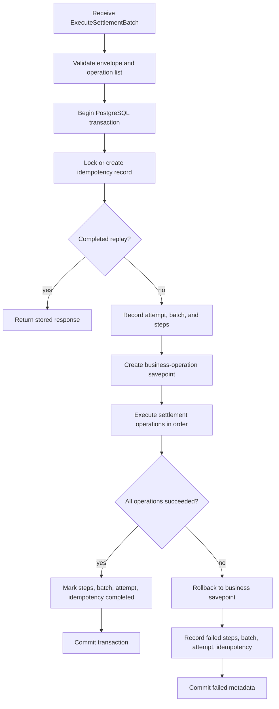

# Information and Data Integrity View

## View Metadata

| Field | Value |
| --- | --- |
| View status | Canonical |
| Last reviewed | 2026-06-23 |
| Governing viewpoint | VP-04 Information And Data Integrity |
| Evidence baseline | Repository commit `fe5c6af`; architecture file hashes are recorded in `18-evidence-manifest.md` |

Governed by: [VP-04 Information And Data Integrity Viewpoint](./02-viewpoints.md#vp-04-information-and-data-integrity-viewpoint)

## Concerns Addressed

This view addresses CON-06, CON-07, CON-08, CON-09, CON-10, CON-11, CON-24,
and CON-33.

## Data Group Model

| Data group | Representative tables or artifacts | Owner | Purpose |
| --- | --- | --- | --- |
| Reference world data | Capsuleer, region, station, item type, local seed data | Database/migration owner | Provides stable local entities for development and tests. |
| Item inventory | Item stack tables and item ledger tables | trade-settlement write path; Market read path | Tracks item ownership, location, quantity, activity, and item movement history. |
| Wallet value | Wallet tables and wallet ledger tables | trade-settlement write path; Market read path | Tracks wallet ownership, balances, activity, escrow, and ISK movement history. |
| Trade lifecycle | Trade instance and trade state-change tables | trade-settlement write path; Market read path | Tracks issuer, item type, quantity, price, state, remaining quantity, and timestamps. |
| Escrow | Item escrow and wallet escrow records | trade-settlement write path; Market read path | Holds items and ISK during issue and accept flows. |
| Settlement metadata | Settlement batch, attempt, step, and operation metadata | trade-settlement | Audits settlement execution, success, failure, and replay outcomes. |
| Idempotency metadata | Idempotency records, fingerprints, statuses, completed responses | trade-settlement and Market read path | Prevents duplicate mutation and supports replay. |
| Protobuf command data | Request and operation messages | API Gateway, Market, messaging, settlement-worker, trade-settlement | Defines portable command data crossing service boundaries. |

## Persistent State Responsibilities

| Responsibility | Primary mechanism |
| --- | --- |
| Authoritative writes | trade-settlement SQL operation handlers inside a PostgreSQL transaction. |
| Current-state reads for validation | Market repository reads from PostgreSQL snapshots. |
| Request replay | Market reads completed idempotency outcomes; trade-settlement enforces write-side idempotency. |
| Audit history | Settlement metadata and append-only ledger tables. |
| Schema creation | SQL migrations under trade-settlement and Kubernetes migration ConfigMaps/jobs. |
| Local deterministic data | `local_dev_world.sql` seed data. |

## Table-Level Model

Model ID: `MODEL-DATA-01`; view component ID: `VC-DATA-01`.

| Table or artifact | Primary role | Important constraints or indexes | Architecture owner |
| --- | --- | --- | --- |
| `idempotency_record` | Tracks request fingerprint, state, and result batch. | Primary key `idempotency_key`; states `IN_PROGRESS`, `COMPLETED`, `FAILED`; result batch FK. | trade-settlement |
| `request_attempt` | Records each attempt number for an idempotency key. | Primary key `request_id`; attempt numbers are computed per idempotency key by the executor; attempt states. | trade-settlement |
| `settlement_batch` | Records one batch execution. | FK to idempotency record; batch states. | trade-settlement |
| `settlement_step` | Records each operation step in a batch. | Unique `(settlement_batch_id, step_index)`; step states; stored `step_output` for replay. | trade-settlement |
| `wallet` | Current wallet balance and checksum. | Primary wallet uniqueness per capsuleer; non-negative ISK; checksum fields. | trade-settlement |
| `wallet_ledger` | Append-only wallet movement audit. | Delta/version checks; append-only triggers. | trade-settlement/database |
| `item_stack` | Current item stack ownership, location, quantity, and checksum. | Non-negative quantity; stack state checks; checksum fields. | trade-settlement |
| `item_stack_ledger` | Append-only, hash-chained item stack history used to reconstruct current stack state. | Ledger sequence equals stack version after; previous/payload/row hashes; delta/version/state checks; projection invariant from latest ledger row to `item_stack`; append-only triggers. | trade-settlement/database |
| `trade_instance` | Trade lifecycle and remaining quantity. | State checks; remaining quantity bounded by total quantity. | trade-settlement |
| `wallet_escrow` | Holds wallet value during settlement. | Non-negative amount; release step references. | trade-settlement |
| `item_stack_escrow` | Holds item quantity during issue/accept/cancel. | Non-negative quantity; active trade uniqueness. | trade-settlement |
| `trade_state_change` | Audit of trade state transitions. | State and change-kind checks. | trade-settlement/database |
| Reference projection tables | Capsuleer, region, station, item type data. | Projection state checks. | database/migration owner |

## Detailed Persistent Schema Register

This register describes the current SQL schema implemented by
`distributed-backend/src/trade-settlement/migrations/0001_settlement_schema.sql`.
It supersedes the older conceptual schema note and includes the implementation
details that exist today.

- `capsuleer`: `capsuleer_id BIGINT` primary key; `capsuleer_name TEXT NOT NULL`; `projection_state TEXT NOT NULL DEFAULT 'ACTIVE'` with values `ACTIVE` or `DELETED`; nullable `last_synced_at TIMESTAMPTZ`; `created_at TIMESTAMPTZ NOT NULL DEFAULT now()`; `updated_at TIMESTAMPTZ NOT NULL DEFAULT now()`.
- `region`: `region_id BIGINT` primary key; `region_name TEXT NOT NULL`; `projection_state TEXT NOT NULL DEFAULT 'ACTIVE'` with values `ACTIVE` or `DELETED`; nullable `last_synced_at TIMESTAMPTZ`; `created_at TIMESTAMPTZ NOT NULL DEFAULT now()`; `updated_at TIMESTAMPTZ NOT NULL DEFAULT now()`.
- `station`: `station_id BIGINT` primary key; `region_id BIGINT NOT NULL` foreign key to `region(region_id)`; `station_name TEXT NOT NULL`; `projection_state TEXT NOT NULL DEFAULT 'ACTIVE'` with values `ACTIVE` or `DELETED`; nullable `last_synced_at TIMESTAMPTZ`; `created_at TIMESTAMPTZ NOT NULL DEFAULT now()`; `updated_at TIMESTAMPTZ NOT NULL DEFAULT now()`.
- `item_type`: `item_type_id BIGINT` primary key; `item_type_name TEXT NOT NULL`; `category_name TEXT NOT NULL`; `group_name TEXT NOT NULL`; `projection_state TEXT NOT NULL DEFAULT 'ACTIVE'` with values `ACTIVE` or `DELETED`; nullable `last_synced_at TIMESTAMPTZ`; `created_at TIMESTAMPTZ NOT NULL DEFAULT now()`; `updated_at TIMESTAMPTZ NOT NULL DEFAULT now()`.
- `idempotency_record`: `idempotency_key TEXT` primary key; `request_fingerprint TEXT NOT NULL`; `request_kind TEXT NOT NULL`; `idempotency_state TEXT NOT NULL` with values `IN_PROGRESS`, `COMPLETED`, or `FAILED`; `created_by_service TEXT NOT NULL`; `created_at TIMESTAMPTZ NOT NULL DEFAULT now()`; nullable `completed_at TIMESTAMPTZ`; nullable `result_settlement_batch_id UUID` foreign key to `settlement_batch(settlement_batch_id)`; nullable `failure_code TEXT`; nullable `failure_message TEXT`.
- `request_attempt`: `request_id UUID` primary key; `idempotency_key TEXT NOT NULL` foreign key to `idempotency_record(idempotency_key)`; `attempt_number INTEGER NOT NULL`; `received_by_service TEXT NOT NULL`; `attempt_state TEXT NOT NULL` with values `IN_PROGRESS`, `COMPLETED`, or `FAILED`; nullable `failure_code TEXT`; nullable `failure_message TEXT`; `received_at TIMESTAMPTZ NOT NULL DEFAULT now()`; nullable `completed_at TIMESTAMPTZ`; unique `(idempotency_key, attempt_number)`.
- `settlement_batch`: `settlement_batch_id UUID` primary key; `request_id UUID NOT NULL` foreign key to `request_attempt(request_id)`; `idempotency_key TEXT NOT NULL` foreign key to `idempotency_record(idempotency_key)`; nullable `external_request_id TEXT`; nullable `caused_by_capsuleer_id BIGINT` foreign key to `capsuleer(capsuleer_id)`; `batch_state TEXT NOT NULL` with values `IN_PROGRESS`, `COMPLETED`, or `FAILED`; `created_by_service TEXT NOT NULL`; `started_at TIMESTAMPTZ NOT NULL DEFAULT now()`; nullable `completed_at TIMESTAMPTZ`; nullable `failure_code TEXT`; nullable `failure_message TEXT`; indexed by `settlement_batch_idempotency_key_idx` on `idempotency_key`.
- `settlement_step`: `settlement_step_id UUID` primary key; `settlement_batch_id UUID NOT NULL` foreign key to `settlement_batch(settlement_batch_id)`; `step_index INTEGER NOT NULL`; `step_kind TEXT NOT NULL`; `step_payload JSONB NOT NULL`; `step_payload_hash TEXT NOT NULL`; `step_output JSONB NOT NULL DEFAULT '{}'::jsonb`; `step_state TEXT NOT NULL` with values `PENDING`, `RUNNING`, `COMPLETED`, or `FAILED`; nullable `started_at TIMESTAMPTZ`; nullable `completed_at TIMESTAMPTZ`; nullable `failure_code TEXT`; nullable `failure_message TEXT`; unique `(settlement_batch_id, step_index)`; indexed by `settlement_step_batch_idx` on `(settlement_batch_id, step_index)`.
- `wallet`: `wallet_id UUID` primary key; `capsuleer_id BIGINT NOT NULL` foreign key to `capsuleer(capsuleer_id)`; `wallet_kind TEXT NOT NULL` with current value `PRIMARY`; `isk_amount BIGINT NOT NULL CHECK (isk_amount >= 0)`; `wallet_state TEXT NOT NULL` with values `ACTIVE`, `SUSPENDED`, or `CLOSED`; `wallet_version BIGINT NOT NULL`; `wallet_checksum TEXT NOT NULL`; `checksum_algorithm TEXT NOT NULL`; `created_at TIMESTAMPTZ NOT NULL DEFAULT now()`; `updated_at TIMESTAMPTZ NOT NULL DEFAULT now()`; indexed by `wallet_capsuleer_idx` on `(capsuleer_id, wallet_kind)`; unique partial index `wallet_primary_capsuleer_unique_idx` on `capsuleer_id` where `wallet_kind = 'PRIMARY'`.
- `wallet_ledger`: `wallet_ledger_id UUID` primary key defaulting to `gen_random_uuid()`; `settlement_step_id UUID NOT NULL` foreign key to `settlement_step(settlement_step_id)`; `wallet_id UUID NOT NULL` foreign key to `wallet(wallet_id)`; `capsuleer_id BIGINT NOT NULL` foreign key to `capsuleer(capsuleer_id)`; `entry_kind TEXT NOT NULL` with values `TRANSFER_TO_ESCROW`, `TRANSFER_FROM_ESCROW_TO_NEW_OWNER`, or `TRANSFER_FROM_ESCROW_TO_PREVIOUS_OWNER`; `isk_amount_delta BIGINT NOT NULL`; `isk_amount_before BIGINT NOT NULL`; `isk_amount_after BIGINT NOT NULL`; `wallet_version_before BIGINT NOT NULL`; `wallet_version_after BIGINT NOT NULL`; `wallet_checksum_before TEXT NOT NULL`; `wallet_checksum_after TEXT NOT NULL`; `created_at TIMESTAMPTZ NOT NULL DEFAULT now()`; check `isk_amount_after = isk_amount_before + isk_amount_delta`; check `wallet_version_after = wallet_version_before + 1`; indexed by `wallet_ledger_wallet_idx` on `(wallet_id, created_at)`; `wallet_ledger_append_only_trigger` rejects update/delete.
- `item_stack`: `item_stack_id UUID` primary key; `owner_id BIGINT NOT NULL` foreign key to `capsuleer(capsuleer_id)`; `item_type_id BIGINT NOT NULL` foreign key to `item_type(item_type_id)`; `station_id BIGINT NOT NULL` foreign key to `station(station_id)`; `quantity BIGINT NOT NULL CHECK (quantity >= 0)`; `stack_state TEXT NOT NULL` with values `ACTIVE`, `LOCKED`, `DEPLETED`, or `MERGED`; `stack_version BIGINT NOT NULL`; `stack_checksum TEXT NOT NULL`; `checksum_algorithm TEXT NOT NULL`; `created_at TIMESTAMPTZ NOT NULL DEFAULT now()`; `updated_at TIMESTAMPTZ NOT NULL DEFAULT now()`; indexed by `item_stack_owner_item_station_idx` on `(owner_id, item_type_id, station_id, stack_state)`.
- `item_stack_ledger`: `item_stack_ledger_id UUID` primary key defaulting to `gen_random_uuid()`; `settlement_step_id UUID NOT NULL` foreign key to `settlement_step(settlement_step_id)`; `item_stack_id UUID NOT NULL` foreign key to `item_stack(item_stack_id)`; `ledger_sequence BIGINT NOT NULL CHECK (ledger_sequence > 0)`; `previous_item_stack_ledger_hash TEXT NOT NULL`; `ledger_payload_hash TEXT NOT NULL`; `item_stack_ledger_hash TEXT NOT NULL`; `item_type_id BIGINT NOT NULL` foreign key to `item_type(item_type_id)`; `owner_id BIGINT NOT NULL` foreign key to `capsuleer(capsuleer_id)`; `station_id BIGINT NOT NULL` foreign key to `station(station_id)`; `entry_kind TEXT NOT NULL` with values `CREATE_STACK`, `TRANSFER_TO_ESCROW`, `TRANSFER_FROM_ESCROW_TO_NEW_OWNER`, `TRANSFER_FROM_ESCROW_TO_PREVIOUS_OWNER`, `MERGE_IN`, or `MERGE_OUT`; `quantity_delta BIGINT NOT NULL`; `quantity_before BIGINT NOT NULL`; `quantity_after BIGINT NOT NULL`; `stack_state_before TEXT NOT NULL` with values `ABSENT`, `ACTIVE`, `LOCKED`, `DEPLETED`, or `MERGED`; `stack_state_after TEXT NOT NULL` with values `ACTIVE`, `LOCKED`, `DEPLETED`, or `MERGED`; `stack_version_before BIGINT NOT NULL`; `stack_version_after BIGINT NOT NULL`; `stack_checksum_before TEXT NOT NULL`; `stack_checksum_after TEXT NOT NULL`; `created_at TIMESTAMPTZ NOT NULL DEFAULT now()`; check `quantity_after = quantity_before + quantity_delta`; check `stack_version_after = stack_version_before + 1`; check `ledger_sequence = stack_version_after`; indexed by `item_stack_ledger_stack_idx` on `(item_stack_id, created_at)`; unique indexes `item_stack_ledger_stack_sequence_unique_idx` on `(item_stack_id, ledger_sequence)` and `item_stack_ledger_stack_hash_unique_idx` on `(item_stack_id, item_stack_ledger_hash)`; `item_stack_ledger_append_only_trigger` rejects update/delete; `item_stack_ledger_insert_integrity_trigger` requires each insert to extend the latest row for that stack and to carry the computed payload and row hashes.
- `trade_instance`: `trade_instance_id UUID` primary key; `created_settlement_step_id UUID NOT NULL` foreign key to `settlement_step(settlement_step_id)`; `trade_kind TEXT NOT NULL` with current value `SELL`; `trade_state TEXT NOT NULL` with values `OPEN`, `CANCELLED`, or `COMPLETED`; `issuer_id BIGINT NOT NULL` foreign key to `capsuleer(capsuleer_id)`; `item_type_id BIGINT NOT NULL` foreign key to `item_type(item_type_id)`; `station_id BIGINT NOT NULL` foreign key to `station(station_id)`; `total_quantity BIGINT NOT NULL CHECK (total_quantity > 0)`; `remaining_quantity BIGINT NOT NULL CHECK (remaining_quantity >= 0 AND remaining_quantity <= total_quantity)`; `unit_price_isk BIGINT NOT NULL CHECK (unit_price_isk > 0)`; nullable `expires_at TIMESTAMPTZ`; `created_at TIMESTAMPTZ NOT NULL DEFAULT now()`; `updated_at TIMESTAMPTZ NOT NULL DEFAULT now()`; indexed by `trade_instance_lookup_idx` on `(item_type_id, station_id, trade_state)`; partial index `trade_instance_open_expires_at_idx` on `expires_at` where `trade_state = 'OPEN' AND expires_at IS NOT NULL`.
- `wallet_escrow`: `wallet_escrow_id UUID` primary key; `trade_instance_id UUID NOT NULL` foreign key to `trade_instance(trade_instance_id)`; `owner_id BIGINT NOT NULL` foreign key to `capsuleer(capsuleer_id)`; `source_wallet_id UUID NOT NULL` foreign key to `wallet(wallet_id)`; `isk_amount BIGINT NOT NULL CHECK (isk_amount >= 0)`; `is_released BOOLEAN NOT NULL DEFAULT false`; `created_settlement_step_id UUID NOT NULL` foreign key to `settlement_step(settlement_step_id)`; nullable `released_settlement_step_id UUID` foreign key to `settlement_step(settlement_step_id)`; `created_at TIMESTAMPTZ NOT NULL DEFAULT now()`; `updated_at TIMESTAMPTZ NOT NULL DEFAULT now()`; nullable `released_at TIMESTAMPTZ`.
- `item_stack_escrow`: `item_stack_escrow_id UUID` primary key; `trade_instance_id UUID NOT NULL` foreign key to `trade_instance(trade_instance_id)`; `owner_id BIGINT NOT NULL` foreign key to `capsuleer(capsuleer_id)`; `source_item_stack_id UUID NOT NULL` foreign key to `item_stack(item_stack_id)`; `item_type_id BIGINT NOT NULL` foreign key to `item_type(item_type_id)`; `station_id BIGINT NOT NULL` foreign key to `station(station_id)`; `quantity BIGINT NOT NULL CHECK (quantity >= 0)`; `is_released BOOLEAN NOT NULL DEFAULT false`; `created_settlement_step_id UUID NOT NULL` foreign key to `settlement_step(settlement_step_id)`; nullable `released_settlement_step_id UUID` foreign key to `settlement_step(settlement_step_id)`; `created_at TIMESTAMPTZ NOT NULL DEFAULT now()`; `updated_at TIMESTAMPTZ NOT NULL DEFAULT now()`; nullable `released_at TIMESTAMPTZ`; unique partial index `item_stack_escrow_active_trade_unique_idx` on `trade_instance_id` where `is_released = false`.
- `trade_state_change`: `trade_state_change_id UUID` primary key defaulting to `gen_random_uuid()`; `settlement_step_id UUID NOT NULL` foreign key to `settlement_step(settlement_step_id)`; `trade_instance_id UUID NOT NULL` foreign key to `trade_instance(trade_instance_id)`; `from_trade_state TEXT NOT NULL` with values `OPEN`, `CANCELLED`, or `COMPLETED`; `to_trade_state TEXT NOT NULL` with values `OPEN`, `CANCELLED`, or `COMPLETED`; `trade_state_change_kind TEXT NOT NULL` with values `ISSUED`, `CANCELLED_BY_ISSUER`, or `ACCEPTED_BY_BUYER`; `changed_by_service TEXT NOT NULL`; `changed_at TIMESTAMPTZ NOT NULL DEFAULT now()`.

Current cross-table SQL functions and constraint triggers:

- `compute_item_stack_ledger_payload_hash()` and `compute_item_stack_ledger_hash()` compute deterministic item-ledger payload hashes and row hashes for the hash chain.
- `reject_ledger_mutation()` backs append-only wallet and item ledger triggers.
- `enforce_item_stack_ledger_insert_integrity()` verifies that a new item-stack ledger row starts from `GENESIS` for the first `CREATE_STACK` row or extends the latest row by sequence, quantity, state, version, checksum, previous hash, and computed hashes.
- `check_item_stack_ledger_projection_invariant()` and `enforce_item_stack_ledger_projection_invariant()` require every current `item_stack` row to match the latest hash-chained `item_stack_ledger` row for owner, item type, station, quantity, state, version, and checksum.
- `check_trade_remaining_quantity_invariant()` and `enforce_trade_remaining_quantity_invariant()` require `trade_instance.remaining_quantity` to match active item escrow quantity and prevent `CANCELLED` or `COMPLETED` trades from retaining active item escrow.
- `check_trade_wallet_escrow_closed_state_invariant()` and `enforce_trade_wallet_escrow_closed_state_invariant()` prevent `CANCELLED` or `COMPLETED` trades from retaining active wallet escrow.
- `trade_instance_remaining_quantity_invariant_trigger` runs after insert/update on `trade_instance`, deferrable initially deferred.
- `item_stack_escrow_remaining_quantity_invariant_trigger` runs after insert/update/delete on `item_stack_escrow`, deferrable initially deferred.
- `trade_instance_wallet_escrow_closed_state_trigger` runs after insert/update on `trade_instance`, deferrable initially deferred.
- `wallet_escrow_closed_trade_invariant_trigger` runs after insert/update/delete on `wallet_escrow`, deferrable initially deferred.
- `item_stack_projection_ledger_invariant_trigger` runs after insert/update on `item_stack`, deferrable initially deferred.
- `item_stack_ledger_projection_invariant_trigger` runs after insert on `item_stack_ledger`, deferrable initially deferred.

## Integrity Invariants

| ID | Invariant | Enforcement location |
| --- | --- | --- |
| INV-01 | A settlement batch must contain at least one operation. | trade-settlement request validation. |
| INV-02 | A completed idempotency key must not execute business mutations again. | trade-settlement idempotency lock and completion replay; Market completed replay reads. |
| INV-03 | Concurrent requests with the same idempotency key must not both execute. | trade-settlement idempotency locking and in-progress conflict behavior. |
| INV-04 | Business mutations in one settlement batch succeed or fail together. | PostgreSQL transaction plus savepoint rollback on operation failure. |
| INV-05 | Failed business operations must not leave partial item, wallet, trade, or escrow mutations. | Savepoint rollback before failed metadata is committed. |
| INV-06 | Failure metadata must survive a settlement failure when possible. | trade-settlement records failed steps, batch, attempt, and idempotency state after rollback of business savepoint. |
| INV-07 | Item and wallet ledger rows cannot be updated or deleted; item-stack history changes are represented only by inserting new `item_stack_ledger` rows. | Database schema, triggers, and service write discipline. |
| INV-08 | Item stack and wallet checksum fields detect inconsistent mutation sequences. Item-stack ledger hashes additionally bind each ledger row to the previous row for the same stack. | trade-settlement checksum logic, SQL hash functions, SQL triggers, and SQL updates. |
| INV-09 | Accepted trade quantity cannot exceed remaining open quantity. | Market validation, item escrow transfer preconditions, and `trade_instance.remaining_quantity` SQL check. |
| INV-10 | Buyer wallet value transfer is consistent with quantity multiplied by price on the current trade row. | Market settlement plan plus trade-settlement row-level wallet/item escrow checks. |
| INV-11 | Cancel returns only quantity present in item escrow to the previous owner. | Market cancellation planning plus item escrow quantity and owner-rule checks. |
| INV-12 | Database schema must exist before services process requests. | Compose migration service and Kubernetes migration job dependency model. |
| INV-13 | Cancelled or completed trades cannot retain active wallet escrow. | Deferrable SQL constraint triggers on `trade_instance` and `wallet_escrow`. |
| INV-14 | A current `item_stack` row must be reconstructable from the latest hash-chained `item_stack_ledger` row for the same stack. | Deferrable SQL constraint triggers on `item_stack` and `item_stack_ledger`. |

## Invariant Enforcement Matrix

Model ID: `MODEL-DATA-02`; view component ID: `VC-DATA-02`.

| Invariant | Service enforcement | SQL enforcement | Test or verification status |
| --- | --- | --- | --- |
| INV-01 | trade-settlement command conversion validates non-empty operation list. | None specific beyond batch/step inserts. | Repository tests should cover command validation; last run not recorded in this doc update. |
| INV-02 | Executor locks idempotency record and returns completed replay. | `idempotency_record` primary key and result batch FK. | Covered by executor behavior; test evidence should be linked in future. |
| INV-03 | Executor rejects `IN_PROGRESS` duplicate key. | Transaction lock on idempotency record. | Source-anchored in EVID-007; concurrency test not linked. |
| INV-04 | Executor uses one PostgreSQL transaction for batch execution. | PostgreSQL transaction semantics. | Source-anchored in EVID-007; live transaction tests not run for this doc update. |
| INV-05 | Executor rolls back to business savepoint on operation failure. | PostgreSQL savepoint semantics. | Source-anchored in EVID-007; failure-mode test not linked. |
| INV-06 | Executor records failed attempt, batch, step, and idempotency state after rollback. | Settlement metadata tables and state checks. | Source-anchored in EVID-007 and EVID-010; test not linked. |
| INV-07 | Ledger updates/deletes are rejected. Item-stack operation handlers insert new ledger rows for creation, transfer, and merge effects. | `wallet_ledger_append_only_trigger` and `item_stack_ledger_append_only_trigger`. | Migration and source evidence. |
| INV-08 | Checksums are recomputed before current-state updates; item-stack ledger inserts recompute and validate payload/row hashes. | Checksum columns exist; SQL hash functions and `item_stack_ledger_insert_integrity_trigger` validate item ledger hashes. | Source-anchored in EVID-007 and EVID-010; live trigger test not run. |
| INV-09 | Market validates requested quantity; settlement updates bounded trade quantity during item escrow release. | `remaining_quantity >= 0 AND remaining_quantity <= total_quantity`. | Market tests exist; last run not recorded in this doc update. |
| INV-10 | Market computes payment from quantity and price; settlement checks payment against current trade price/remaining quantity and applies wallet operations. | Wallet ledger delta checks and non-negative wallet amount. | Source-anchored in EVID-004 and EVID-010; DB operation test not linked. |
| INV-11 | Market plans return of remaining escrow; settlement checks escrow quantity and previous-owner destination before release. | Escrow release step FK fields. | Source-anchored in EVID-004 and EVID-010; DB operation test not linked. |
| INV-12 | Compose migration and Kubernetes migration job apply schema before useful service processing. | Migration files are schema source. | Deployment-order assumptions documented; live deploy not run. |
| INV-13 | Settlement operation handlers release wallet escrow in normal flows. | `trade_instance_wallet_escrow_closed_state_trigger` and `wallet_escrow_closed_trade_invariant_trigger`. | SQL evidence; trigger behavior test not linked. |
| INV-14 | `CreateNewEmptyItemStack` inserts an initial `CREATE_STACK` ledger row; item stack mutations append transfer or merge ledger rows. | `item_stack_projection_ledger_invariant_trigger` and `item_stack_ledger_projection_invariant_trigger` require the current row to match the latest ledger row. | SQL and Rust source evidence; live trigger test not run. |

## Invariant Test And Evidence Register

| Invariant | Evidence anchor | Test status | Exact tests or gaps |
| --- | --- | --- | --- |
| INV-01 | EVID-008 | No current test linked | `commands.rs` validates operation presence; no named Rust test found in quick scan. |
| INV-02 | EVID-007, EVID-010 | Partial test coverage | Market replay conflict tests exist; settlement executor replay tests are not linked. |
| INV-03 | EVID-007 | No current test linked | `executor.rs` uses `FOR UPDATE` and `IN_PROGRESS` states; no named concurrency test found. |
| INV-04 | EVID-007 | No current test linked | Executor transaction and savepoint paths are source-anchored; live transaction test not run. |
| INV-05 | EVID-007 | No current test linked | Savepoint rollback path is source-anchored; failure-mode test not linked. |
| INV-06 | EVID-007, EVID-010 | No current test linked | Failed metadata schema and executor update paths are source-anchored; test gap remains. |
| INV-07 | EVID-007, EVID-010 | SQL and source evidence | Ledger append-only triggers are in migrations; operation handlers append new item ledger rows; trigger behavior test not linked. |
| INV-08 | EVID-007, EVID-010 | SQL and source evidence | Checksum columns, update logic, item-ledger hash functions, and hash validation triggers are source-anchored; independent checksum audit absent. |
| INV-09 | EVID-004, EVID-010 | Partial test coverage | `TestAcceptTradeInstancePaysSellerAsNewWalletOwner`; SQL remaining-quantity checks. |
| INV-10 | EVID-004, EVID-010 | Partial test coverage | `TestAcceptTradeInstancePaysSellerAsNewWalletOwner`; wallet ledger SQL checks. |
| INV-11 | EVID-004 | Partial test coverage | `TestCancelTradeInstanceCanOnlyModifyTradeState`; full escrow-return DB test not linked. |
| INV-12 | EVID-013, EVID-014 | Not run | Compose/Kubernetes migration order is modeled; live deploy validation was not run. |
| INV-13 | EVID-010 | SQL evidence | Closed-trade wallet escrow invariant is implemented in migration SQL; trigger behavior test not linked. |
| INV-14 | EVID-007, EVID-010 | SQL and source evidence | Item-stack projection invariant and initial `CREATE_STACK` ledger writes are implemented; live trigger behavior test not linked. |

## Transaction Model

## Operation Data Categories

| Operation category | Examples of effects |
| --- | --- |
| Trade operations | Create a trade instance, update remaining quantity, mark accepted/closed/canceled state. |
| Item stack operations | Decrease seller source stack, increase buyer destination stack, create destination stack if needed. |
| Item escrow operations | Place issued quantity into escrow, release accepted quantity, return canceled remaining quantity. |
| Wallet operations | Reserve buyer funds, transfer accepted price, update buyer and seller balances. |
| Wallet escrow operations | Hold and release ISK during settlement. |
| Ledger operations | Append wallet movement records and hash-chained item stack ledger records. Item-stack merges append separate `MERGE_OUT` and `MERGE_IN` rows; existing ledger rows are not modified or combined. |
| Settlement metadata operations | Record batch, attempt, step status, step output, failure reason, and idempotent response. |

## Settlement Operation Semantics

Model ID: `MODEL-DATA-03`; view component ID: `VC-DATA-03`.

| Operation | Required fields | Preconditions | Tables touched | Failure modes | Test or gap |
| --- | --- | --- | --- | --- | --- |
| `CreateNewTradeInstanceRow` | issuer, item type, quantity, unit price, source stack context | Valid issuer, item type, quantity, unit price, and source stack context from Market plan. | `trade_instance`, `settlement_step` | Invalid references, invalid quantity/price, duplicate step output. | Market planning test exists; Rust DB operation test not linked. |
| `ModifyTradeInstanceState` | trade ID, target state, change kind, changed-by service | Trade exists; transition is permitted by the operation handler; completing a trade requires no remaining item or wallet escrow. | `trade_instance`, `trade_state_change`, `settlement_step` | Invalid transition, active escrow prevents completion, unsupported state/change kind. | Market cancel planning test exists; DB transition test not linked. |
| `CreateNewEmptyItemStack` | owner, item type, location | Owner, item type, and location are valid. | `item_stack`, `item_stack_ledger`, `settlement_step` | Invalid owner/item/location or missing initial `CREATE_STACK` ledger row. | Market accept planning test exists; Rust DB operation test not linked. |
| `TransferQuantityFromItemStackToItemStackEscrow` | source stack, escrow/trade, quantity | Source stack active, quantity available, and any existing escrow matches the source stack/trade context. | `item_stack`, `item_stack_escrow`, `item_stack_ledger`, `settlement_step` | Insufficient quantity, inactive source, incompatible existing escrow. | Market issue planning test exists; DB operation test not linked. |
| `TransferQuantityFromItemStackEscrowToItemStackWithNewOwner` | escrow, destination stack, quantity | Escrow unreleased; destination stack is active, has matching item type/station, belongs to a different owner than the escrow owner, and active wallet escrow matches the trade price for the released quantity. | `item_stack_escrow`, `item_stack`, `item_stack_ledger`, `trade_instance`, `settlement_step` | Released escrow, owner-rule mismatch, item/station mismatch, quantity mismatch, payment mismatch. | Market accept planning test exists; DB operation test not linked. |
| `TransferQuantityFromItemStackEscrowToItemStackWithPreviousOwner` | escrow, destination stack, quantity | Escrow unreleased; destination stack is active, has matching item type/station, and belongs to the escrow owner. | `item_stack_escrow`, `item_stack`, `item_stack_ledger`, `trade_instance`, `settlement_step` | Released escrow, owner-rule mismatch, item/station mismatch, quantity mismatch. | Escrow-return DB test not linked. |
| `MergeItemStacksWithIdenticalItemTypeAndIdenticalOwner` | source stack, destination stack | Source and destination differ and share owner, item type, and station; both stacks are active. | `item_stack`, `item_stack_ledger`, `settlement_step` | Mismatched owner/item/station, invalid source or destination state, or ledger rows that do not extend each stack's existing hash chain. | DB operation test not linked. |
| `CreateNewEmptyWalletEscrow` | trade, owner, source wallet | Source wallet exists, is active, and belongs to the provided owner. | `wallet_escrow`, `wallet`, `settlement_step` | Invalid source wallet, inactive wallet, owner mismatch. | Market accept planning test exists; DB operation test not linked. |
| `TransferIskAmountFromWalletToWalletEscrow` | source wallet, escrow, trade, amount | Source wallet active, sufficient balance, payment amount matches the current trade price and remaining quantity, and any existing escrow matches source/trade context. | `wallet`, `wallet_escrow`, `wallet_ledger`, `trade_instance`, `settlement_step` | Insufficient balance, inactive wallet, invalid or incompatible escrow, payment mismatch. | Market accept planning test exists; DB operation test not linked. |
| `TransferIskAmountFromWalletEscrowToWalletWithNewOwner` | escrow, destination wallet, amount | Escrow unreleased; destination wallet is active and belongs to a different owner than the escrow owner. | `wallet_escrow`, `wallet`, `wallet_ledger`, `settlement_step` | Released escrow, owner-rule mismatch, invalid amount. | Market accept planning test exists; DB operation test not linked. |
| `TransferIskAmountFromWalletEscrowToWalletWithPreviousOwner` | escrow, destination wallet, amount | Escrow unreleased; destination wallet is active and belongs to the escrow owner. | `wallet_escrow`, `wallet`, `wallet_ledger`, `settlement_step` | Released escrow, owner-rule mismatch, invalid amount. | DB operation test not linked. |

## Migration Model

| Migration artifact | Role |
| --- | --- |
| `0001_settlement_schema.sql` | Single canonical settlement migration file. It creates the schema on clean databases and contains current item stack merge constraints, item-ledger hash-chain columns/functions/triggers, stored settlement step output, append-only ledger triggers, item-stack projection invariants, and closed-trade escrow invariants. |
| Kubernetes base migration manifests | Mount and run `0001_settlement_schema.sql` in cluster deployment. |
| Compose `migrate` service | Runs `0001_settlement_schema.sql` before local services start, then applies local seed data. |
| `local_dev_world.sql` | Seeds deterministic local test/demo data. |

## Data Lifecycle And Retention

| Data category | Current retention model | Required decision before production |
| --- | --- | --- |
| Trade instances | Retained in PostgreSQL after state changes. | Decide archival/purge policy and reporting needs. |
| Item and wallet ledgers | Append-only and retained indefinitely by current schema; item ledgers are also hash-chained per stack and must remain reconstructable. | Define growth, partitioning, archival, backup, and restore policy. |
| Settlement metadata | Retained for replay and diagnosis. | Define completed/failed attempt retention and privacy classification. |
| Idempotency records | Retained for replay/fingerprint conflict detection. | Define TTL or permanent-retention decision aligned with client retry windows. |
| Escrow records | Retained with release step references. | Define cleanup/reporting for old released escrows. |
| Reference projections | Seeded locally and migrated by schema scripts. | Define source-of-truth sync policy if game world data changes. |

## Data Integrity View Assertions

| Assertion | Enforcement tag | Evidence or gap |
| --- | --- | --- |
| Persistent state is centralized in PostgreSQL so trade invariants can be maintained transactionally. | Enforced | trade-settlement executor uses PostgreSQL transaction for business operations. |
| Market reads authoritative state and the current repository routes durable business writes through trade-settlement operation handlers. | Enforced by repository split | Market repository is read/replay oriented; mutation operations live in trade-settlement. |
| Settlement metadata is part of business integrity. | Enforced | Idempotency, attempt, batch, and step tables record request execution. |
| Ledger append-only behavior is a data integrity requirement. | Enforced by database triggers | Wallet and item ledger append-only triggers reject update/delete; item-stack ledger insert/projection triggers require new rows to extend the existing chain and match the current stack projection. |
| Retention, archival, and partitioning are production architecture gaps. | Gap recorded | No retention or partitioning policy exists in the repository. |

## Concern Satisfaction

| Concern | How this view satisfies it | Evidence or gap |
| --- | --- | --- |
| CON-06 | Transaction and savepoint model. | Transaction Model and INV-04/INV-05. |
| CON-07 | Idempotency metadata and replay behavior. | Table-Level Model and Invariant Enforcement Matrix. |
| CON-08 | Append-only ledger invariants. | SQL triggers, item-ledger hash-chain checks, projection triggers, and ledger tables. |
| CON-09 | Trade quantity/state invariants. | Trade table checks and Market/settlement responsibilities. |
| CON-10 | Failed settlement metadata. | Settlement attempt, batch, step, and idempotency records. |
| CON-11 | Migrations and local seed data. | Migration Model. |
| CON-24 | Migrations before service usefulness. | Compose and Kubernetes migration model. |
| CON-33 | Settlement metadata supports diagnosis. | Metadata tables and resilience/observability views. |

## Aspect Application

| Aspect | Data element |
| --- | --- |
| ASP-02 Idempotency | `idempotency_record`, settlement attempt, replay behavior. |
| ASP-03 Transactional integrity | PostgreSQL transaction, savepoint, and business operation sequence. |
| ASP-08 Schema governance | Migrations, constraints, triggers, indexes, and seed data. |
