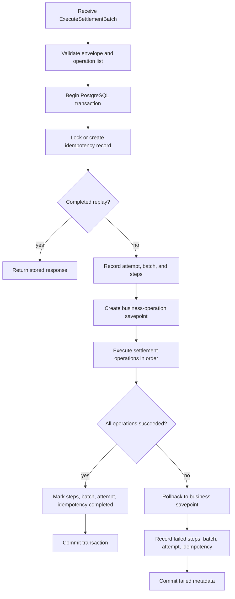

# Information and Data Integrity View

## View Metadata

| Field | Value |
| --- | --- |
| View status | Canonical |
| Last reviewed | 2026-06-23 |
| Governing viewpoint | VP-04 Information And Data Integrity |
| Evidence baseline | Repository commit `fe5c6af`; architecture file hashes are recorded in `18-evidence-manifest.md` |

Governed by: [VP-04 Information And Data Integrity Viewpoint](./02-viewpoints.md#vp-04-information-and-data-integrity-viewpoint)

## Concerns Addressed

This view addresses CON-06, CON-07, CON-08, CON-09, CON-10, CON-11, CON-24,
and CON-33.

## Data Group Model

| Data group | Representative tables or artifacts | Owner | Purpose |
| --- | --- | --- | --- |
| Reference world data | Capsuleer, region, station, item type, local seed data | Database/migration owner | Provides stable local entities for development and tests. |
| Item inventory | Item stack tables and item ledger tables | trade-settlement write path; Market read path | Tracks item ownership, location, quantity, activity, and item movement history. |
| Wallet value | Wallet tables and wallet ledger tables | trade-settlement write path; Market read path | Tracks wallet ownership, balances, activity, escrow, and ISK movement history. |
| Trade lifecycle | Trade instance and trade state-change tables | trade-settlement write path; Market read path | Tracks issuer, item type, quantity, price, state, remaining quantity, and timestamps. |
| Escrow | Item escrow and wallet escrow records | trade-settlement write path; Market read path | Holds items and ISK during issue and accept flows. |
| Settlement metadata | Settlement batch, attempt, step, and operation metadata | trade-settlement | Audits settlement execution, success, failure, and replay outcomes. |
| Idempotency metadata | Idempotency records, fingerprints, statuses, completed responses | trade-settlement and Market read path | Prevents duplicate mutation and supports replay. |
| Protobuf command data | Request and operation messages | API Gateway, Market, messaging, settlement-worker, trade-settlement | Defines portable command data crossing service boundaries. |

## Persistent State Responsibilities

| Responsibility | Primary mechanism |
| --- | --- |
| Authoritative writes | trade-settlement SQL operation handlers inside a PostgreSQL transaction. |
| Current-state reads for validation | Market repository reads from PostgreSQL snapshots. |
| Request replay | Market reads completed idempotency outcomes; trade-settlement enforces write-side idempotency. |
| Audit history | Settlement metadata and append-only ledger tables. |
| Schema creation | SQL migrations under trade-settlement and Kubernetes migration ConfigMaps/jobs. |
| Local deterministic data | `local_dev_world.sql` seed data. |

## Table-Level Model

Model ID: `MODEL-DATA-01`; view component ID: `VC-DATA-01`.

| Table or artifact | Primary role | Important constraints or indexes | Architecture owner |
| --- | --- | --- | --- |
| `idempotency_record` | Tracks request fingerprint, state, and result batch. | Primary key `idempotency_key`; states `IN_PROGRESS`, `COMPLETED`, `FAILED`; result batch FK. | trade-settlement |
| `request_attempt` | Records each attempt number for an idempotency key. | Primary key `request_id`; attempt numbers are computed per idempotency key by the executor; attempt states. | trade-settlement |
| `settlement_batch` | Records one batch execution. | FK to idempotency record; batch states. | trade-settlement |
| `settlement_step` | Records each operation step in a batch. | Unique `(settlement_batch_id, step_index)`; step states. | trade-settlement |
| `wallet` | Current wallet balance and checksum. | Primary wallet uniqueness per capsuleer; non-negative ISK; checksum fields. | trade-settlement |
| `wallet_ledger` | Append-only wallet movement audit. | Delta/version checks; append-only triggers. | trade-settlement/database |
| `item_stack` | Current item stack ownership, location, quantity, and checksum. | Non-negative quantity; stack state checks; checksum fields. | trade-settlement |
| `item_stack_ledger` | Append-only item movement audit. | Delta/version checks; append-only triggers. | trade-settlement/database |
| `trade_instance` | Trade lifecycle and remaining quantity. | State checks; remaining quantity bounded by total quantity. | trade-settlement |
| `wallet_escrow` | Holds wallet value during settlement. | Non-negative amount; release step references. | trade-settlement |
| `item_stack_escrow` | Holds item quantity during issue/accept/cancel. | Non-negative quantity; active trade uniqueness. | trade-settlement |
| `trade_state_change` | Audit of trade state transitions. | State and change-kind checks. | trade-settlement/database |
| Reference projection tables | Capsuleer, region, station, item type data. | Projection state checks. | database/migration owner |

## Integrity Invariants

| ID | Invariant | Enforcement location |
| --- | --- | --- |
| INV-01 | A settlement batch must contain at least one operation. | trade-settlement request validation. |
| INV-02 | A completed idempotency key must not execute business mutations again. | trade-settlement idempotency lock and completion replay; Market completed replay reads. |
| INV-03 | Concurrent requests with the same idempotency key must not both execute. | trade-settlement idempotency locking and in-progress conflict behavior. |
| INV-04 | Business mutations in one settlement batch succeed or fail together. | PostgreSQL transaction plus savepoint rollback on operation failure. |
| INV-05 | Failed business operations must not leave partial item, wallet, trade, or escrow mutations. | Savepoint rollback before failed metadata is committed. |
| INV-06 | Failure metadata must survive a settlement failure when possible. | trade-settlement records failed steps, batch, attempt, and idempotency state after rollback of business savepoint. |
| INV-07 | Item and wallet ledgers are append-only audit records. | Database schema, triggers, and service write discipline. |
| INV-08 | Item stack and wallet checksum fields detect inconsistent mutation sequences. | trade-settlement checksum logic and SQL updates. |
| INV-09 | Accepted trade quantity cannot exceed remaining open quantity. | Market validation, item escrow transfer preconditions, and `trade_instance.remaining_quantity` SQL check. |
| INV-10 | Buyer wallet value transfer is consistent with quantity multiplied by price on the current trade row. | Market settlement plan plus trade-settlement row-level wallet/item escrow checks. |
| INV-11 | Cancel returns only quantity present in item escrow to the previous owner. | Market cancellation planning plus item escrow quantity and owner-rule checks. |
| INV-12 | Database schema must exist before services process requests. | Compose migration service and Kubernetes migration job dependency model. |

## Invariant Enforcement Matrix

Model ID: `MODEL-DATA-02`; view component ID: `VC-DATA-02`.

| Invariant | Service enforcement | SQL enforcement | Test or verification status |
| --- | --- | --- | --- |
| INV-01 | trade-settlement command conversion validates non-empty operation list. | None specific beyond batch/step inserts. | Repository tests should cover command validation; last run not recorded in this doc update. |
| INV-02 | Executor locks idempotency record and returns completed replay. | `idempotency_record` primary key and result batch FK. | Covered by executor behavior; test evidence should be linked in future. |
| INV-03 | Executor rejects `IN_PROGRESS` duplicate key. | Transaction lock on idempotency record. | Source-anchored in EVID-007; concurrency test not linked. |
| INV-04 | Executor uses one PostgreSQL transaction for batch execution. | PostgreSQL transaction semantics. | Source-anchored in EVID-007; live transaction tests not run for this doc update. |
| INV-05 | Executor rolls back to business savepoint on operation failure. | PostgreSQL savepoint semantics. | Source-anchored in EVID-007; failure-mode test not linked. |
| INV-06 | Executor records failed attempt, batch, step, and idempotency state after rollback. | Settlement metadata tables and state checks. | Source-anchored in EVID-007 and EVID-010; test not linked. |
| INV-07 | Ledger updates/deletes are rejected. | `wallet_ledger_append_only_trigger` and `item_stack_ledger_append_only_trigger`. | Migration evidence. |
| INV-08 | Checksums are recomputed before current-state updates. | Checksum columns exist; algorithm enforcement is in service code. | Source-anchored in EVID-007; no independent checksum audit tool documented. |
| INV-09 | Market validates requested quantity; settlement updates bounded trade quantity during item escrow release. | `remaining_quantity >= 0 AND remaining_quantity <= total_quantity`. | Market tests exist; last run not recorded in this doc update. |
| INV-10 | Market computes payment from quantity and price; settlement checks payment against current trade price/remaining quantity and applies wallet operations. | Wallet ledger delta checks and non-negative wallet amount. | Source-anchored in EVID-004 and EVID-010; DB operation test not linked. |
| INV-11 | Market plans return of remaining escrow; settlement checks escrow quantity and previous-owner destination before release. | Escrow release step FK fields. | Source-anchored in EVID-004 and EVID-010; DB operation test not linked. |
| INV-12 | Compose migration and Kubernetes migration job apply schema before useful service processing. | Migration files are schema source. | Deployment-order assumptions documented; live deploy not run. |

## Invariant Test And Evidence Register

| Invariant | Evidence anchor | Test status | Exact tests or gaps |
| --- | --- | --- | --- |
| INV-01 | EVID-008 | No current test linked | `commands.rs` validates operation presence; no named Rust test found in quick scan. |
| INV-02 | EVID-007, EVID-010 | Partial test coverage | Market replay conflict tests exist; settlement executor replay tests are not linked. |
| INV-03 | EVID-007 | No current test linked | `executor.rs` uses `FOR UPDATE` and `IN_PROGRESS` states; no named concurrency test found. |
| INV-04 | EVID-007 | No current test linked | Executor transaction and savepoint paths are source-anchored; live transaction test not run. |
| INV-05 | EVID-007 | No current test linked | Savepoint rollback path is source-anchored; failure-mode test not linked. |
| INV-06 | EVID-007, EVID-010 | No current test linked | Failed metadata schema and executor update paths are source-anchored; test gap remains. |
| INV-07 | EVID-010 | SQL evidence | Ledger append-only triggers are in migrations; trigger behavior test not linked. |
| INV-08 | EVID-007, EVID-010 | No current test linked | Checksum columns and update logic are source-anchored; independent checksum audit absent. |
| INV-09 | EVID-004, EVID-010 | Partial test coverage | `TestAcceptTradeInstancePaysSellerAsNewWalletOwner`; SQL remaining-quantity checks. |
| INV-10 | EVID-004, EVID-010 | Partial test coverage | `TestAcceptTradeInstancePaysSellerAsNewWalletOwner`; wallet ledger SQL checks. |
| INV-11 | EVID-004 | Partial test coverage | `TestCancelTradeInstanceCanOnlyModifyTradeState`; full escrow-return DB test not linked. |
| INV-12 | EVID-013, EVID-014 | Not run | Compose/Kubernetes migration order is modeled; live deploy validation was not run. |

## Transaction Model

## Operation Data Categories

| Operation category | Examples of effects |
| --- | --- |
| Trade operations | Create a trade instance, update remaining quantity, mark accepted/closed/canceled state. |
| Item stack operations | Decrease seller source stack, increase buyer destination stack, create destination stack if needed. |
| Item escrow operations | Place issued quantity into escrow, release accepted quantity, return canceled remaining quantity. |
| Wallet operations | Reserve buyer funds, transfer accepted price, update buyer and seller balances. |
| Wallet escrow operations | Hold and release ISK during settlement. |
| Ledger operations | Append item and wallet movement records for audit. |
| Settlement metadata operations | Record batch, attempt, step status, failure reason, and idempotent response. |

## Settlement Operation Semantics

Model ID: `MODEL-DATA-03`; view component ID: `VC-DATA-03`.

| Operation | Required fields | Preconditions | Tables touched | Failure modes | Test or gap |
| --- | --- | --- | --- | --- | --- |
| `CreateNewTradeInstanceRow` | issuer, item type, quantity, unit price, source stack context | Valid issuer, item type, quantity, unit price, and source stack context from Market plan. | `trade_instance`, `settlement_step` | Invalid references, invalid quantity/price, duplicate step output. | Market planning test exists; Rust DB operation test not linked. |
| `ModifyTradeInstanceState` | trade ID, target state, change kind, changed-by service | Trade exists; transition is permitted by the operation handler; completing a trade requires no remaining item or wallet escrow. | `trade_instance`, `trade_state_change`, `settlement_step` | Invalid transition, active escrow prevents completion, unsupported state/change kind. | Market cancel planning test exists; DB transition test not linked. |
| `CreateNewEmptyItemStack` | owner, item type, location | Owner, item type, and location are valid. | `item_stack`, `settlement_step` | Invalid owner/item/location. | Market accept planning test exists; Rust DB operation test not linked. |
| `TransferQuantityFromItemStackToItemStackEscrow` | source stack, escrow/trade, quantity | Source stack active, quantity available, and any existing escrow matches the source stack/trade context. | `item_stack`, `item_stack_escrow`, `item_stack_ledger`, `settlement_step` | Insufficient quantity, inactive source, incompatible existing escrow. | Market issue planning test exists; DB operation test not linked. |
| `TransferQuantityFromItemStackEscrowToItemStackWithNewOwner` | escrow, destination stack, quantity | Escrow unreleased; destination stack is active, has matching item type/station, belongs to a different owner than the escrow owner, and active wallet escrow matches the trade price for the released quantity. | `item_stack_escrow`, `item_stack`, `item_stack_ledger`, `trade_instance`, `settlement_step` | Released escrow, owner-rule mismatch, item/station mismatch, quantity mismatch, payment mismatch. | Market accept planning test exists; DB operation test not linked. |
| `TransferQuantityFromItemStackEscrowToItemStackWithPreviousOwner` | escrow, destination stack, quantity | Escrow unreleased; destination stack is active, has matching item type/station, and belongs to the escrow owner. | `item_stack_escrow`, `item_stack`, `item_stack_ledger`, `trade_instance`, `settlement_step` | Released escrow, owner-rule mismatch, item/station mismatch, quantity mismatch. | Escrow-return DB test not linked. |
| `MergeItemStacksWithIdenticalItemTypeAndIdenticalOwner` | source stack, destination stack | Source and destination differ and share owner, item type, and station; both stacks are active. | `item_stack`, `item_stack_ledger`, `settlement_step` | Mismatched owner/item/station, invalid source or destination state. | DB operation test not linked. |
| `CreateNewEmptyWalletEscrow` | trade, owner, source wallet | Source wallet exists, is active, and belongs to the provided owner. | `wallet_escrow`, `wallet`, `settlement_step` | Invalid source wallet, inactive wallet, owner mismatch. | Market accept planning test exists; DB operation test not linked. |
| `TransferIskAmountFromWalletToWalletEscrow` | source wallet, escrow, trade, amount | Source wallet active, sufficient balance, payment amount matches the current trade price and remaining quantity, and any existing escrow matches source/trade context. | `wallet`, `wallet_escrow`, `wallet_ledger`, `trade_instance`, `settlement_step` | Insufficient balance, inactive wallet, invalid or incompatible escrow, payment mismatch. | Market accept planning test exists; DB operation test not linked. |
| `TransferIskAmountFromWalletEscrowToWalletWithNewOwner` | escrow, destination wallet, amount | Escrow unreleased; destination wallet is active and belongs to a different owner than the escrow owner. | `wallet_escrow`, `wallet`, `wallet_ledger`, `settlement_step` | Released escrow, owner-rule mismatch, invalid amount. | Market accept planning test exists; DB operation test not linked. |
| `TransferIskAmountFromWalletEscrowToWalletWithPreviousOwner` | escrow, destination wallet, amount | Escrow unreleased; destination wallet is active and belongs to the escrow owner. | `wallet_escrow`, `wallet`, `wallet_ledger`, `settlement_step` | Released escrow, owner-rule mismatch, invalid amount. | DB operation test not linked. |

## Migration Model

| Migration artifact | Role |
| --- | --- |
| `0001_settlement_schema.sql` | Creates the core settlement schema, trade, escrow, wallet, item, ledger, and metadata structures. |
| `0002_merge_item_stack_constraints.sql` | Applies additional item stack constraints used by the current schema. |
| Kubernetes base migration manifests | Mount and run schema migrations in cluster deployment. |
| Compose `migrate` service | Runs local schema migrations before local services start. |
| `local_dev_world.sql` | Seeds deterministic local test/demo data. |

## Data Lifecycle And Retention

| Data category | Current retention model | Required decision before production |
| --- | --- | --- |
| Trade instances | Retained in PostgreSQL after state changes. | Decide archival/purge policy and reporting needs. |
| Item and wallet ledgers | Append-only and retained indefinitely by current schema. | Define growth, partitioning, archival, backup, and restore policy. |
| Settlement metadata | Retained for replay and diagnosis. | Define completed/failed attempt retention and privacy classification. |
| Idempotency records | Retained for replay/fingerprint conflict detection. | Define TTL or permanent-retention decision aligned with client retry windows. |
| Escrow records | Retained with release step references. | Define cleanup/reporting for old released escrows. |
| Reference projections | Seeded locally and migrated by schema scripts. | Define source-of-truth sync policy if game world data changes. |

## Data Integrity View Assertions

| Assertion | Enforcement tag | Evidence or gap |
| --- | --- | --- |
| Persistent state is centralized in PostgreSQL so trade invariants can be maintained transactionally. | Enforced | trade-settlement executor uses PostgreSQL transaction for business operations. |
| Market reads authoritative state and the current repository routes durable business writes through trade-settlement operation handlers. | Enforced by repository split | Market repository is read/replay oriented; mutation operations live in trade-settlement. |
| Settlement metadata is part of business integrity. | Enforced | Idempotency, attempt, batch, and step tables record request execution. |
| Ledger append-only behavior is a data integrity requirement. | Enforced by database triggers | Wallet and item ledger append-only triggers reject update/delete. |
| Retention, archival, and partitioning are production architecture gaps. | Gap recorded | No retention or partitioning policy exists in the repository. |

## Concern Satisfaction

| Concern | How this view satisfies it | Evidence or gap |
| --- | --- | --- |
| CON-06 | Transaction and savepoint model. | Transaction Model and INV-04/INV-05. |
| CON-07 | Idempotency metadata and replay behavior. | Table-Level Model and Invariant Enforcement Matrix. |
| CON-08 | Append-only ledger invariants. | SQL triggers and ledger tables. |
| CON-09 | Trade quantity/state invariants. | Trade table checks and Market/settlement responsibilities. |
| CON-10 | Failed settlement metadata. | Settlement attempt, batch, step, and idempotency records. |
| CON-11 | Migrations and local seed data. | Migration Model. |
| CON-24 | Migrations before service usefulness. | Compose and Kubernetes migration model. |
| CON-33 | Settlement metadata supports diagnosis. | Metadata tables and resilience/observability views. |

## Aspect Application

| Aspect | Data element |
| --- | --- |
| ASP-02 Idempotency | `idempotency_record`, settlement attempt, replay behavior. |
| ASP-03 Transactional integrity | PostgreSQL transaction, savepoint, and business operation sequence. |
| ASP-08 Schema governance | Migrations, constraints, triggers, indexes, and seed data. |
