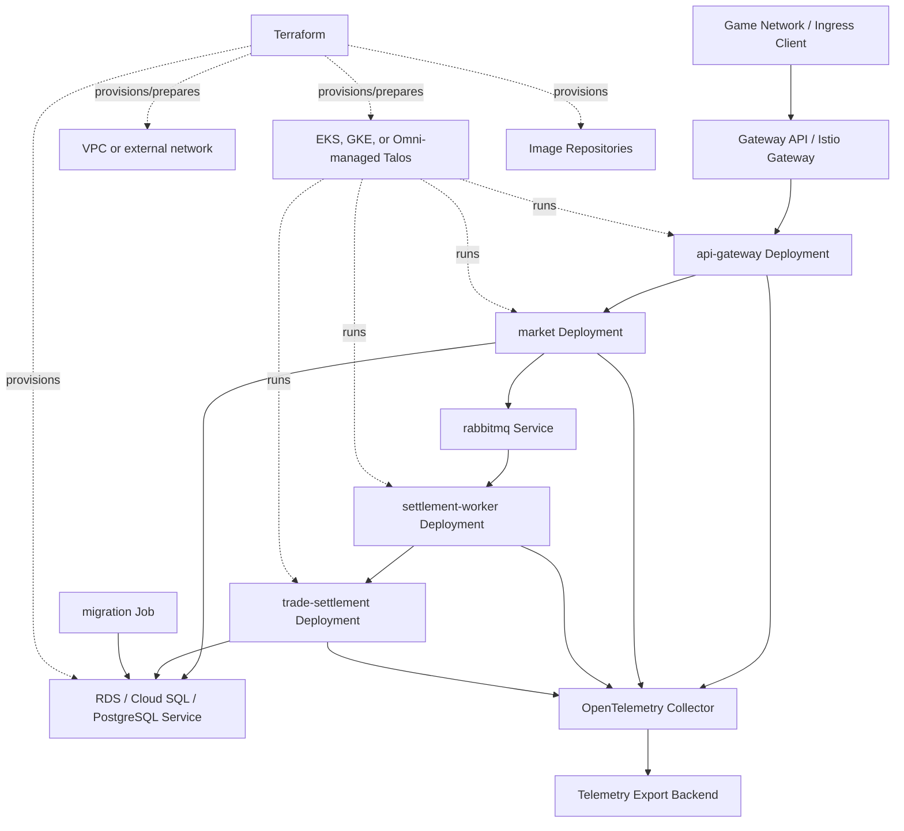

# Deployment and Operations View

## View Metadata

| Field | Value |
| --- | --- |
| View status | Canonical |
| Last reviewed | 2026-06-23 |
| Governing viewpoint | VP-05 Deployment And Operations |
| Evidence baseline | Repository commit `fe5c6af`; architecture file hashes are recorded in `18-evidence-manifest.md` |

Governed by: [VP-05 Deployment And Operations Viewpoint](./02-viewpoints.md#vp-05-deployment-and-operations-viewpoint)

## Concerns Addressed

This view addresses CON-12, CON-13, CON-16, CON-23, CON-24, CON-25, CON-26,
CON-27, and CON-34.

## Local Deployment Model

Local development uses Docker Compose.

| Compose service | Runtime role | Notable dependency |
| --- | --- | --- |
| `postgres` | Local PostgreSQL database | Database volume and loopback port. |
| `migrate` | Applies SQL migrations and local seed data | Depends on PostgreSQL readiness. |
| `rabbitmq` | Local settlement broker and management UI | AMQP and management ports on loopback. |
| `trade-settlement` | Rust settlement service | Depends on migrated PostgreSQL. |
| `settlement-worker` | RabbitMQ consumer and trade-settlement caller | Depends on RabbitMQ and trade-settlement. |
| `market` | Go trade policy service | Depends on PostgreSQL and RabbitMQ. |
| `api-gateway` | Game-facing local entry point | Depends on Market; publishes `localhost:8080`. |

Local ports expose developer access to API Gateway, PostgreSQL, RabbitMQ AMQP,
and RabbitMQ management UI on loopback. These exposures are local-only; the
checked-in production-like ingress model is Gateway/Istio to API Gateway.

## Local-Only Exposure Model

| Local exposure | Compose binding | Production-like manifest behavior |
| --- | --- | --- |
| API Gateway | `127.0.0.1:8080:8080` | API Gateway ingress is modeled through Gateway/Istio resources. |
| PostgreSQL | `127.0.0.1:5432:5432` | Database egress is broad TCP `5432`; no public database ingress is modeled here. |
| RabbitMQ AMQP | `127.0.0.1:5672:5672` | RabbitMQ is reached by Market and settlement-worker through cluster service policy. |
| RabbitMQ management UI | `127.0.0.1:15672:15672` | No production-like RabbitMQ management UI ingress is modeled in this ISO view. |

## Production-Like Deployment Model

Model ID: `MODEL-DEP-01`; view component ID: `VC-DEP-01`.

## Kubernetes Runtime Elements

| Element | Location | Role |
| --- | --- | --- |
| Base Deployments and Services | `distributed-backend/orchestration/kubernetes/base` | Defines service workloads, ports, probes, service accounts, and ConfigMaps. |
| Migration Job | Kubernetes base manifests | Applies database migrations before serving traffic. |
| Production overlay | `distributed-backend/orchestration/kubernetes/overlay/prod` | Adds production resource governance, HPAs, PDBs, network policies, traffic policy, and security resources. |
| Gateway platform manifests | `distributed-backend/orchestration/kubernetes/platform/gateway/prod` | Defines Gateway API ingress and related platform resources. |
| Istio platform manifests | `distributed-backend/orchestration/kubernetes/platform/istio/prod` | Defines service mesh operator and related resources. |
| Observability manifests | `distributed-backend/orchestration/kubernetes/base/observability` and `observability/honeycomb` | Defines collector and telemetry export configuration. |
| Terraform deployment roots | `distributed-backend/terraform/eks`, `distributed-backend/terraform/gke`, `distributed-backend/terraform/talos-omni` | Provision or prepare target-specific infrastructure and runtime assets for AWS/EKS, GCP/GKE, or Omni-managed Talos. |

## Probe Model

| Service | Expected endpoints | Current operational meaning | Current gap or limitation |
| --- | --- | --- | --- |
| API Gateway | `/healthz`, `/readyz` | Liveness means process is up; readiness checks Market reachability. | No wider downstream or trade-flow readiness is checked. |
| Market | `/healthz`, `/readyz` | Liveness means process is up; readiness checks PostgreSQL via `repository.Ping` and checks the RabbitMQ client session when the RabbitMQ transport is active. | End-to-end settlement-worker/trade-settlement reply-path readiness is not actively checked by Market readiness. |
| settlement-worker | `/healthz`, `/readyz` | Liveness means process is up; readiness reflects the worker health status set by the RabbitMQ consumer loop. | No separate trade-settlement dependency probe is modeled beyond request execution behavior. |
| trade-settlement | Kubernetes TCP socket probes on port `9092` | Proves the gRPC port is accepting TCP connections; does not prove PostgreSQL is reachable or settlement can commit. | Database commit readiness is not probed. |

## Compose Healthcheck Versus Kubernetes Probe Model

| Runtime | Service | Check | Meaning |
| --- | --- | --- | --- |
| Compose | `postgres` | `pg_isready` | Local database accepts connections. |
| Compose | `rabbitmq` | `rabbitmq-diagnostics -q ping` | Local broker responds. |
| Compose | `settlement-worker` | `GET /readyz` | Worker readiness, tied to worker health status. |
| Compose | `market` | `GET /readyz` | Market readiness, including PostgreSQL and RabbitMQ client-session readiness for the default RabbitMQ transport. |
| Compose | `api-gateway` | `GET /readyz` | API Gateway readiness, including Market reachability. |
| Kubernetes | `api-gateway` | `GET /readyz`, `GET /healthz` | Readiness checks Market; liveness checks process. |
| Kubernetes | `market` | `GET /readyz`, `GET /healthz` | Readiness checks PostgreSQL and RabbitMQ client-session readiness when RabbitMQ transport is active. |
| Kubernetes | `settlement-worker` | `GET /readyz`, `GET /healthz` | Readiness reflects worker health status. |
| Kubernetes | `trade-settlement` | TCP socket startup/readiness/liveness probes | Port-open check only. |

## Network Policy Intent

View component ID: `VC-DEP-02`.

| Flow | Intended allowance | Current manifest precision |
| --- | --- | --- |
| Gateway namespace to API Gateway | Allow ingress from the configured ingress/gateway namespace to API Gateway. | Namespace label selector to API Gateway port `8080`. |
| API Gateway to Market | Allow API Gateway egress to Market and Market ingress from API Gateway. | Pod selector to Market port `8081`. |
| Market to PostgreSQL | Allow Market egress to database for validation reads and idempotency replay reads. | Broad TCP `5432` egress without destination selector. |
| Market to RabbitMQ | Allow Market egress to RabbitMQ AMQP for settlement commands. | Pod selector to RabbitMQ port `5672`. |
| RabbitMQ from Market and settlement-worker | Allow broker ingress only from command publishers and consumers. | Pod selectors for Market and settlement-worker to port `5672`. |
| settlement-worker to RabbitMQ | Allow worker egress to RabbitMQ for consuming commands and publishing replies. | Pod selector to RabbitMQ port `5672`. |
| settlement-worker to trade-settlement | Allow worker egress and settlement ingress for settlement RPC. | Pod selector to trade-settlement port `9092`. |
| trade-settlement to PostgreSQL | Allow settlement egress to database for durable mutation. | Broad TCP `5432` egress without destination selector. |
| migration job to PostgreSQL | Allow migration egress to database for schema setup. | Broad TCP `5432` egress without destination selector. |
| DNS egress | Allow workloads to resolve service names. | UDP/TCP `53` egress for all selected pods. |
| Application telemetry egress | Allow application pods to send OTLP to collector. | Egress to observability namespace collector on `4317` and `4318`. |
| Istio control-plane egress | Allow sidecars/workloads to reach istiod. | Egress to `istio-system` on `15012`, `15017`, and `443`. |
| Default paths | Deny unless explicitly allowed by policy. | Default deny ingress and egress policy exists. |

The broad database egress rules are current manifest behavior, not
least-privilege proof. No repository manifest in this review narrows the
database destination beyond TCP port `5432`.

## Database Egress Precision

| Environment | Current control | Current precision gap |
| --- | --- | --- |
| Local Compose | Loopback PostgreSQL port for developer use. | Local-only exposure. |
| Kubernetes with in-cluster PostgreSQL | Broad TCP `5432` egress in current policy. | No pod/namespace destination selector is modeled for database egress. |
| Kubernetes with external managed PostgreSQL | Broad TCP `5432` egress in current policy. | Destination restriction would depend on cloud/network controls outside the checked-in NetworkPolicy. |
| Omni-managed Talos with external PostgreSQL | Broad TCP `5432` egress in current policy. | Destination restriction depends on the operator's Talos/Omni network, firewall, and PostgreSQL placement outside the checked-in NetworkPolicy. |
| Migration job | Broad TCP `5432` egress in current policy. | Same broad destination precision as application database egress. |

## Configuration Model

| Configuration type | Mechanism |
| --- | --- |
| Service ports and downstream URLs | ConfigMaps and service-specific environment variables. |
| Database credentials | Kubernetes Secrets or local Compose environment variables. |
| RabbitMQ credentials and URLs | Kubernetes Secrets/ConfigMaps or local Compose environment variables. |
| Telemetry endpoint and service name | ConfigMaps and observability configuration. |
| Image references | Kubernetes kustomization images and Terraform image repository outputs. |

## Production Placeholders And Deployment Gaps

| Placeholder or input | Source | Current repository state | Enforcement status |
| --- | --- | --- | --- |
| Image digests | Production overlay README and kustomization | Placeholder/zero digest replacement is described but not enforced. | Not implemented; GATE-003 open |
| Public hostname | Gateway and HTTPRoute manifests | Example hostname `api.eve-trade.example.com` appears in manifests/docs. | Not implemented; GATE-003 open |
| ACME email | Gateway platform ClusterIssuer | Placeholder email remains in checked-in platform manifests. | Not implemented; GATE-003 open |
| JWT issuer, JWKS URI, and audience | `istio-security.yaml` | Example issuer/JWKS/audience values remain placeholders. | Not implemented; GATE-003 open |
| Database secret | `trade-settlement-database` secret reference | Runtime expects `DATABASE_URL`; production secret material is not in repo. | Not implemented; GATE-003 open |
| RabbitMQ secret | `rabbitmq` secret reference | Runtime expects broker credentials/URL; production secret material is not in repo. | Not implemented; GATE-003 open |
| Observability secrets | `observability-backends` secret reference | Export credentials are out of band. | Not implemented; GATE-003 open |

No checked-in CI check, release script, policy-as-code rule, or admission policy
currently rejects example hosts, example identity issuer values, placeholder
emails, zero image digests, or missing production secrets.

## Secrets Model

View component ID: `VC-DEP-03`.

| Secret or credential | Consumers | Current source | Owner | Rotation | Access/audit requirement | Status |
| --- | --- | --- | --- | --- | --- | --- |
| `DATABASE_URL` | Market, trade-settlement, migration job | Kubernetes Secret or Compose environment | SRE/database owner | Rotation policy not defined in repo | Secret read access is modeled by workload secret references; break-glass logging is not implemented in repo | Gap recorded |
| RabbitMQ username/password/URL | RabbitMQ, Market, settlement-worker | Kubernetes Secret or Compose environment | SRE/platform owner | Per-service rotation policy not defined in repo | Broker publisher/consumer/admin permission separation is not documented. | Gap recorded |
| JWT issuer/JWKS/audience | Istio RequestAuthentication | Production overlay placeholders | Security/platform owner | Follows external identity provider lifecycle when configured | Current rendered values are placeholders until replaced outside this repo. | Production blocker |
| Observability API keys | OpenTelemetry/Honeycomb/Sentry components | Out-of-band secret | Observability owner | Rotation policy not defined in repo | Export credentials are not present in checked-in manifests. | Gap recorded |

## Infrastructure Constraints And Cost Drivers

| Area | Architecture constraint | Cost or capacity driver |
| --- | --- | --- |
| EKS/GKE/Omni-managed Talos/Kubernetes | Services assume Kubernetes Deployments, Services, probes, and network policy. | Cluster baseline cost and pod resource requests/limits. |
| PostgreSQL | Settlement correctness depends on transactional PostgreSQL. | RDS, Cloud SQL, external operated PostgreSQL, or non-production in-cluster PostgreSQL storage growth from ledgers, backups, and connection count. |
| RabbitMQ | Settlement path depends on AMQP command/reply behavior. | Broker durability, quorum queues, queue depth, and management overhead. |
| Observability | Services emit telemetry to collector. | Trace/log/metric volume and external backend ingestion. |
| Image repositories | Terraform provisions runtime image assets. | Storage, scanning, retention, and cross-environment promotion. |

## Operational Assertions

| Assertion | Enforcement tag | Evidence or gap |
| --- | --- | --- |
| Local Compose and Kubernetes both preserve the same logical service chain. | Enforced by manifest | Compose and Kubernetes both include API Gateway, Market, RabbitMQ, settlement-worker, trade-settlement, and PostgreSQL/migration path. |
| Migrations are operationally part of startup. | Enforced by manifest | Compose `migrate` and Kubernetes migration job exist. |
| Network policies encode intended service reachability rules. | Partially enforced | Business flows are encoded; database egress is broad TCP `5432`. |
| Readiness probes cover only part of downstream dependency health. | Partially enforced | API Gateway and Market readiness cover some dependencies; trade-settlement uses TCP probe only and Market does not probe the full settlement reply path. |
| Observability is deployed as platform support for all business services. | Partially enforced | Collector manifests exist; alert/dashboard requirements are documented in Observability view. |

## Concern Satisfaction

| Concern | How this view satisfies it | Evidence or gap |
| --- | --- | --- |
| CON-12 | Probe model distinguishes process, dependency, and TCP readiness. | Remaining settlement reply-path and trade-settlement readiness gaps documented. |
| CON-13 | RabbitMQ deployment and DLQ config are represented. | Runtime and resilience views define DLQ semantics. |
| CON-16 | Local and Kubernetes deployment paths are shown. | Compose and Kubernetes models. |
| CON-23 | Runtime services, ports, config, and dependencies are listed. | Local and production-like deployment models. |
| CON-24 | Migration job/service is modeled. | Migration rows in local and Kubernetes models. |
| CON-25 | Probes and telemetry paths are documented. | Probe model and observability egress. |
| CON-26 | Network paths are listed with current manifest precision. | Network Policy Intent table. |
| CON-27 | Terraform and infrastructure constraints are identified. | Infrastructure Constraints table. |
| CON-34 | Health/readiness endpoint behavior is explicit. | Probe Model and Compose/Kubernetes comparison. |
