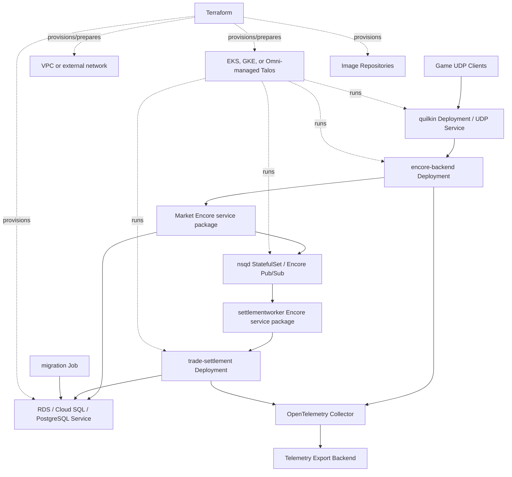

# Deployment and Operations View

## View Metadata

| Field | Value |
| --- | --- |
| View status | Canonical current state |
| Last reviewed | 2026-06-25 |
| Governing viewpoint | VP-05 Deployment And Operations |
| Evidence baseline | v6 architecture cleanup; starting commit recorded in `changes/v6/changes.md` |

Governed by: [VP-05 Deployment And Operations Viewpoint](./02-viewpoints.md#vp-05-deployment-and-operations-viewpoint)

## Concerns Addressed

This view addresses CON-12, CON-13, CON-16, CON-23, CON-24, CON-25, CON-26,
CON-27, and CON-34.

## Local Deployment Model

Local Go development uses `encore run`. PostgreSQL, NSQ, Quilkin, the simulator,
and Rust trade-settlement remain external support services because they are not
packaged by Encore's Go runtime.

| Local component | Runtime role | Notable dependency |
| --- | --- | --- |
| `encore run` | Runs the Encore Go app containing gateway, Market, and settlementworker services. | PostgreSQL, NSQ, and trade-settlement configuration. |
| `postgres` | Local PostgreSQL database | Database volume and loopback port. |
| `migrate` | Applies SQL migrations and local seed data | Depends on PostgreSQL readiness. |
| `nsqd` | Local Encore Pub/Sub backend | NSQ TCP `4150` and HTTP inspection `4151` when self-hosted. |
| `trade-settlement` | Rust settlement service | Depends on migrated PostgreSQL. |
| `quilkin` | Local UDP proxy/routing edge | Forwards UDP `26001` to Encore gateway UDP `26000`. |
| `simulator` | Local game-frontend simulator | Sends signed production-shaped GUI packets to Quilkin. |

Local ports expose developer access to the simulator, Quilkin UDP, Encore gateway
health/readiness, PostgreSQL, NSQ TCP, and NSQ HTTP inspection endpoint on
loopback. These exposures are local-only. Production overlays exclude simulator
resources and use Quilkin as the UDP ingress point.

## Local-Only Exposure Model

| Local exposure | local Encore/Kubernetes binding | Production-like manifest behavior |
| --- | --- | --- |
| Simulator | `127.0.0.1:8000:8000` | Simulator is excluded from production overlays. |
| Quilkin UDP | `127.0.0.1:26001:26001/udp` | Production overlay exposes Quilkin UDP through its service. |
| gateway health/readiness | `127.0.0.1:8080:8080` | Production HTTP exposure is health/readiness only; trade traffic enters through Quilkin UDP. |
| PostgreSQL | `127.0.0.1:5432:5432` | Database egress is broad TCP `5432`; no public database ingress is modeled here. |
| NSQ TCP | `127.0.0.1:4150:4150` | Encore Pub/Sub is reached by the Encore backend through service policy. |
| NSQ HTTP inspection endpoint | `127.0.0.1:4151:4151` | No production-like NSQ HTTP inspection endpoint ingress is modeled in this ISO view. |

## Production-Like Deployment Model

Model ID: `MODEL-DEP-01`; view component ID: `VC-DEP-01`.

## Kubernetes Runtime Elements

| Element | Location | Role |
| --- | --- | --- |
| Base Deployments and Services | `distributed-backend/orchestration/kubernetes/base` | Defines service workloads, ports, probes, service accounts, and ConfigMaps. |
| Migration Job | Kubernetes base manifests | Applies database migrations before serving traffic. |
| Production overlay | `distributed-backend/orchestration/kubernetes/overlay/prod` | Adds production resource governance, HPAs, PDBs, network policies, traffic policy, and security resources. |
| Production Quilkin overlay | `distributed-backend/orchestration/kubernetes/overlay/prod/quilkin.yaml` | Adds production UDP proxy/routing deployment and service. |
| Local simulator overlay | `distributed-backend/orchestration/kubernetes/overlay/local/simulator.yaml` | Adds the local frontend simulator and local-only packet signing secret; not included in production. |
| Gateway platform manifests | `distributed-backend/orchestration/kubernetes/platform/gateway/prod` | Defines Gateway API ingress and related platform resources. |
| Istio platform manifests | `distributed-backend/orchestration/kubernetes/platform/istio/prod` | Defines service mesh operator and related resources. |
| Observability manifests | `distributed-backend/orchestration/kubernetes/base/observability` and `distributed-backend/orchestration/kubernetes/observability/honeycomb` | Defines collector and telemetry export configuration. |
| Terraform deployment roots | `distributed-backend/terraform/eks`, `distributed-backend/terraform/gke`, `distributed-backend/terraform/talos-omni` | Provision or prepare target-specific infrastructure and runtime assets for AWS/EKS, GCP/GKE, or Omni-managed Talos. |

## Probe Model

| Service | Expected endpoints | Current operational meaning | Current gap or limitation |
| --- | --- | --- | --- |
| Encore backend gateway service | `/gateway/healthz`, `/gateway/readyz` | Liveness means process is up; readiness reflects Encore backend availability; UDP listener health is process/config dependent. | No wider downstream or trade-flow readiness is checked. |
| Encore backend Market service | `/market/healthz`, `/market/readyz` | Readiness checks PostgreSQL via `repository.Ping`; Pub/Sub is runtime-managed by Encore. | End-to-end settlementworker/trade-settlement completion is asynchronous and not proven by Market readiness. |
| Encore backend settlementworker service | `/settlementworker/healthz`, `/settlementworker/readyz` | Readiness checks configured Rust trade-settlement reachability where possible. | It does not prove a future settlement commit will succeed. |
| trade-settlement | Kubernetes TCP socket probes on port `9092` | Proves the gRPC port is accepting TCP connections; does not prove PostgreSQL is reachable or settlement can commit. | Database commit readiness is not probed. |

## local Encore/Kubernetes Healthcheck Versus Kubernetes Probe Model

| Runtime | Service | Check | Meaning |
| --- | --- | --- | --- |
| local Encore/Kubernetes | `postgres` | `pg_isready` | Local database accepts connections. |
| local Encore/Kubernetes | `nsqd` | HTTP `/ping` on `4151` | Local Pub/Sub backend responds. |
| local Encore/Kubernetes | `encore-backend` | `GET /gateway/readyz`, `GET /market/readyz`, `GET /settlementworker/readyz` | Service-specific readiness inside the one Encore application. |
| Kubernetes | `encore-backend` | `GET /gateway/healthz`, `GET /market/readyz` | Liveness/readiness for the single Encore application image. |
| Kubernetes | `trade-settlement` | TCP socket startup/readiness/liveness probes | Port-open check only. |

## Network Policy Intent

View component ID: `VC-DEP-02`.

| Flow | Intended allowance | Current manifest precision |
| --- | --- | --- |
| Gateway namespace to Encore backend | Allow ingress from the configured ingress/gateway namespace to the Encore backend HTTP port. | Namespace label selector to `encore-backend` port `4000`. |
| Quilkin to Encore gateway UDP | Allow Quilkin to forward UDP packets to the Encore backend UDP listener. | Pod selector to `encore-backend` UDP `26000`. |
| Encore backend to PostgreSQL | Allow Market package code to read validation/idempotency state. | Broad TCP `5432` egress without destination selector. |
| Encore backend to Encore Pub/Sub | Allow Market publish and settlementworker subscription/result publication. | Pod selector to `nsqd` TCP `4150`. |
| Encore Pub/Sub from Encore backend | Allow topic publishers/subscribers from the Encore backend. | Pod selector from `encore-backend` to `nsqd` TCP `4150`. |
| settlement worker to trade-settlement | Allow worker egress and settlement ingress for settlement RPC. | Pod selector to trade-settlement port `9092`. |
| trade-settlement to PostgreSQL | Allow settlement egress to database for durable mutation. | Broad TCP `5432` egress without destination selector. |
| migration job to PostgreSQL | Allow migration egress to database for schema setup. | Broad TCP `5432` egress without destination selector. |
| DNS egress | Allow workloads to resolve service names. | UDP/TCP `53` egress for all selected pods. |
| Application telemetry egress | Allow application pods to send OTLP to collector. | Egress to observability namespace collector on `4317` and `4318`. |
| Istio control-plane egress | Allow sidecars/workloads to reach istiod. | Egress to `istio-system` on `15012`, `15017`, and `443`. |
| Default paths | Deny unless explicitly allowed by policy. | Default deny ingress and egress policy exists. |

The broad database egress rules are current manifest behavior, not
least-privilege proof. No repository manifest in this review narrows the
database destination beyond TCP port `5432`.

## Database Egress Precision

| Environment | Current control | Current precision gap |
| --- | --- | --- |
| Local local Encore/Kubernetes | Loopback PostgreSQL port for developer use. | Local-only exposure. |
| Kubernetes with in-cluster PostgreSQL | Broad TCP `5432` egress in current policy. | No pod/namespace destination selector is modeled for database egress. |
| Kubernetes with external managed PostgreSQL | Broad TCP `5432` egress in current policy. | Destination restriction would depend on cloud/network controls outside the checked-in NetworkPolicy. |
| Omni-managed Talos with external PostgreSQL | Broad TCP `5432` egress in current policy. | Destination restriction depends on the operator's Talos/Omni network, firewall, and PostgreSQL placement outside the checked-in NetworkPolicy. |
| Migration job | Broad TCP `5432` egress in current policy. | Same broad destination precision as application database egress. |

## Configuration Model

| Configuration type | Mechanism |
| --- | --- |
| Service ports and downstream targets | ConfigMaps and service-specific environment variables. |
| Database credentials | Kubernetes Secrets or local Encore/Kubernetes environment variables. |
| Encore Pub/Sub infrastructure configuration | Kubernetes Secrets/ConfigMaps or local Encore/Kubernetes environment variables. |
| Telemetry endpoint and service name | ConfigMaps and observability configuration. |
| Image references | Kubernetes kustomization images and Terraform image repository outputs. |

## Production Placeholders And Deployment Gaps

| Placeholder or input | Source | Current repository state | Enforcement status |
| --- | --- | --- | --- |
| Image digests | Production overlay README and kustomization | Source templates remain unresolved until release promotion. The verifier rejects zero, repeated, sentinel, example-registry, and registry-unresolvable identities. | Strict release verification enforced; unresolved-template mode is explicit and non-production |
| Public hostname | Gateway and HTTPRoute manifests | Example hostname `api.eve-trade.example.com` appears in manifests/docs. | Not implemented; GATE-003 open |
| ACME email | Gateway platform ClusterIssuer | Placeholder email remains in checked-in platform manifests. | Not implemented; GATE-003 open |
| Market database secret | `market-database` secret reference | Market expects read-only `MARKET_DATABASE_URL`; production secret material is not in repo. | Not implemented; GATE-003 open |
| Settlement database secret | `trade-settlement-database` secret reference | trade-settlement expects settlement writer `DATABASE_URL`; production secret material is not in repo. | Not implemented; GATE-003 open |
| Encore Pub/Sub secret | `nsqd` secret reference | Runtime expects broker credentials/URL; production secret material is not in repo. | Not implemented; GATE-003 open |
| Edge HMAC secret | `encore-backend-edge-auth` secret reference | Runtime expects `GAME_PACKET_HMAC_SECRET`; production secret material is not in repo. | Not implemented; GATE-003 open |
| Observability secrets | `observability-backends` secret reference | Export credentials are out of band. | Not implemented; GATE-003 open |

Checked-in render policy rejects placeholder image identities and unresolved
production templates in strict mode. Hostnames, ACME identity, and production
secret material remain release/operator inputs and are not represented as valid
runtime credentials in source.

## Secrets Model

View component ID: `VC-DEP-03`.

| Secret or credential | Consumers | Current source | Owner | Rotation | Access/audit requirement | Status |
| --- | --- | --- | --- | --- | --- | --- |
| `MARKET_DATABASE_URL` | Encore backend Market package | Kubernetes Secret or local Encore/Kubernetes environment | SRE/database owner | Rotation policy not defined in repo | Must be read-only at the PostgreSQL grant level and separate from settlement writer access. | Enforced by manifest contract; production role provisioning remains out of band |
| `DATABASE_URL` | trade-settlement and migration job, with separate runtime and migration Secrets | Kubernetes Secret or local Encore/Kubernetes environment | SRE/database owner | Rotation policy not defined in repo | Settlement writer and migration credentials must not be injected into the Encore backend workload. | Enforced by manifest contract |
| Encore Pub/Sub infrastructure credentials/configuration | Encore backend and NSQ | Infrastructure config or local Encore/Kubernetes environment | SRE/platform owner | Rotation policy not defined in repo | Broker publisher/consumer/admin permission separation is delegated to the selected Pub/Sub backend. | Gap recorded |
| `GAME_PACKET_HMAC_SECRET` | Encore gateway UDP edge | Production secret manager or Kubernetes Secret | Security/platform owner | Rotation policy not defined in repo | Must match the game frontend signing key without identifying local simulator traffic. | Production blocker |
| Observability API keys | OpenTelemetry/Honeycomb/Sentry components | Out-of-band secret | Observability owner | Rotation policy not defined in repo | Export credentials are not present in checked-in manifests. | Gap recorded |

## Infrastructure Constraints And Cost Drivers

| Area | Architecture constraint | Cost or capacity driver |
| --- | --- | --- |
| EKS/GKE/Omni-managed Talos/Kubernetes | Services assume Kubernetes Deployments, Services, probes, and network policy. | Cluster baseline cost and pod resource requests/limits. |
| PostgreSQL | Settlement correctness depends on transactional PostgreSQL. | RDS, Cloud SQL, external operated PostgreSQL, or non-production in-cluster PostgreSQL storage growth from ledgers, backups, and connection count. |
| Encore Pub/Sub | Settlement path depends on typed at-least-once work delivery and result visibility. | Backend durability, queue depth, retry load, and management overhead. |
| Observability | Services emit telemetry to collector. | Trace/log/metric volume and external backend ingestion. |
| Image repositories | Terraform provisions runtime image assets. | Storage, scanning, retention, and cross-environment promotion. |

## Operational Assertions

| Assertion | Enforcement tag | Evidence or gap |
| --- | --- | --- |
| Local Encore and Kubernetes both preserve the same logical service chain. | Enforced by manifest | Both include Encore gateway, Market, Encore Pub/Sub, settlementworker, trade-settlement, and PostgreSQL/migration path. |
| Migrations are operationally part of startup. | Enforced by manifest | Local support services and Kubernetes migration job apply the settlement schema. |
| Network policies encode intended service reachability rules. | Partially enforced | Business flows are encoded; database egress is broad TCP `5432`. |
| Readiness reflects owned dependencies and advertised paths. | Enforced by probes/tests | Gateway readiness requires Market and a live UDP listener; Rust exposes standard gRPC liveness/readiness with database checks; worker readiness uses health RPC and never invokes mutation. |
| Observability is deployed as platform support for all business services. | Partially enforced | Collector manifests exist; alert/dashboard requirements are documented in Observability view. |

## Concern Satisfaction

| Concern | How this view satisfies it | Evidence or gap |
| --- | --- | --- |
| CON-12 | Probe model distinguishes process, dependency, and TCP readiness. | Remaining settlement reply-path and trade-settlement readiness gaps documented. |
| CON-13 | Encore Pub/Sub deployment and retry config are represented. | Runtime and resilience views define DLQ semantics. |
| CON-16 | Local and Kubernetes deployment paths are shown. | Local Encore/Kubernetes and Kubernetes models. |
| CON-23 | Runtime services, ports, config, and dependencies are listed. | Local and production-like deployment models. |
| CON-24 | Migration job/service is modeled. | Migration rows in local and Kubernetes models. |
| CON-25 | Probes and telemetry paths are documented. | Probe model and observability egress. |
| CON-26 | Network paths are listed with current manifest precision. | Network Policy Intent table. |
| CON-27 | Terraform and infrastructure constraints are identified. | Infrastructure Constraints table. |
| CON-34 | Health/readiness endpoint behavior is explicit. | Probe Model and local Encore/Kubernetes/Kubernetes comparison. |
