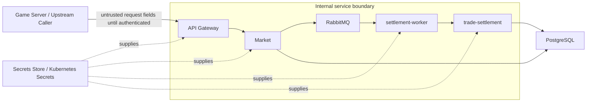

# Security and Trust View

## View Metadata

| Field | Value |
| --- | --- |
| View status | Canonical |
| Last reviewed | 2026-06-23 |
| Governing viewpoint | VP-06 Security And Trust |
| Evidence baseline | Repository commit `fe5c6af`; architecture file hashes are recorded in `18-evidence-manifest.md` |

Governed by: [VP-06 Security And Trust Viewpoint](./02-viewpoints.md#vp-06-security-and-trust-viewpoint)

## Concerns Addressed

This view addresses CON-17, CON-18, CON-19, CON-20, CON-21, and CON-22.

## Trust Boundary Model

Model ID: `MODEL-SEC-01`; view component ID: `VC-SEC-01`.

## Control And Gap Table

| Security concern | Current control | Residual gap or risk |
| --- | --- | --- |
| Internal service exposure | API Gateway is the public entry point; Kubernetes network policies restrict internal ingress paths. | Local development publishes more ports for convenience; production ingress depends on correct Gateway/Istio deployment. |
| Market policy ownership | API Gateway forwards to Market; settlement operations are constructed by Market. | Direct access to Market or settlement APIs bypasses the intended game-facing entry point. |
| Settlement operation privilege | In the checked-in production-like topology, trade-settlement receives requests from settlement-worker. | The settlement protobuf exposes generic mutation operations; no operation-provenance or operation-allow policy is implemented in trade-settlement. |
| Actor identity trust | Requests carry actor and ownership identifiers; Market validates ownership against database snapshots. | End-to-end authentication and JWT/identity-provider enforcement are not fully implemented in the repository. Client-supplied actor fields remain a trust assumption. |
| Network reachability precision | Production overlay includes default deny and service-specific network policy paths. | Policies have not been rendered/applied in a target cluster during this update; database egress remains broad TCP `5432`. |
| Secret placement | ConfigMaps and Secrets are used for runtime configuration. | Secret rotation, external secret provider integration, and production credential lifecycle are outside the service code and not fully defined in repo. |
| Transport security | Gateway/Istio manifests define production ingress and service security resources. | h2c/plaintext service communication exists inside local/internal paths; mTLS enforcement is not verified here. |
| Auditability | Settlement metadata and append-only ledgers record durable effects and failures; item-stack ledgers are hash-chained and current stack rows must match the latest item ledger row. | Cross-service request correlation depends on consistent request IDs, trace propagation, and telemetry export availability. |

## Security Control Layers

| Layer | Implemented or documented controls | Current gaps |
| --- | --- | --- |
| Application layer | API Gateway forwards trade commands; Market validates ownership against database snapshots; trade-settlement validates command-envelope and row-level operation preconditions. | Application code does not yet bind request actor IDs to authenticated identity claims. |
| Mesh layer | Production overlay defines strict mTLS, `RequestAuthentication`, default-deny `AuthorizationPolicy`, service-account principals, and allowed RPC paths. | JWT issuer/JWKS/audience are placeholders until patched for the target environment. |
| Kubernetes network layer | Default deny, service-specific ingress/egress, telemetry egress, DNS egress, and Istio control-plane egress are defined. | Database egress is broad TCP `5432` without destination selector in current manifests. |
| Broker layer | RabbitMQ credentials, internal service reachability, command queue, and dead-letter queue exist. | Per-service broker credentials, credential rotation, and broker-level authorization policy are not fully documented. |
| Secret layer | Kubernetes Secrets are referenced for database, RabbitMQ, and observability credentials. | External secret provider, rotation, break-glass access, and ownership are not defined. |
| Operations layer | CI/CD and Kubernetes overlay docs describe deployment preconditions. | No formal security sign-off, threat-model review cadence, or incident runbook is defined. |

## Current Actor Identity Binding Gap

Market currently validates ownership using actor fields carried in requests.
The repository does not implement a complete mapping from authenticated identity
claims to those actor fields.

| Request field | Current trust gap |
| --- | --- |
| `issued_by_capsuleer_id` | Accepted from request data and checked against item ownership snapshots. |
| `buyer_capsuleer_id` | Accepted from request data and checked against buyer wallet/destination ownership snapshots. |
| `cancelled_by_capsuleer_id` | Accepted from request data and checked against trade issuer snapshots. |
| `external_request_id` | Accepted from upstream request data for correlation. |
| `idempotency_key` | Accepted from request data; actor-scoped key policy is not fully specified. |

This is recorded as a production-readiness gap, not as an implemented control.

## Settlement API Access And Gaps

View component ID: `VC-SEC-02`.

| Topic | Current state | Status |
| --- | --- | --- |
| Checked-in production-like caller path | NetworkPolicy allows settlement-worker to reach trade-settlement on `9092`; Market has no trade-settlement egress in the production overlay. | Partially enforced by manifests; render/apply/negative tests not recorded |
| Service identity | Mesh principal policy exists in production overlay. | Partially enforced; depends on mesh deployment and verification. |
| Settlement operation payloads | Rust command conversion and operation handlers validate required fields plus row-level preconditions. | Enforced by code; test links incomplete |
| Market compromise impact | Market can construct privileged generic settlement operations for the broker/direct executor path. | Gap |
| Broker publishers | Network policy and broker credentials restrict the normal path. | Partially enforced; per-service broker authorization not documented. |
| Settlement call audit data | Settlement metadata records batch, request attempt, step, service, and actor fields. | Enforced, with observability gaps |

## Current Settlement Access Model

| Caller identity | Current modeled capability | Current gap |
| --- | --- | --- |
| settlement-worker service account | Production overlay allows RPC to trade-settlement. | Broker provenance and operation-level policy are not implemented in trade-settlement. |
| Market service account | Production overlay allows RabbitMQ publish and database reads; direct trade-settlement RPC is not allowed by NetworkPolicy. | Market binary still supports direct/connect transport outside this configured topology. |
| API Gateway service account | No direct settlement command publication or trade-settlement RPC is modeled. | Negative-path tests are not implemented. |
| Human/operator | No normal direct mutation path is modeled. | Break-glass procedure and audit trail are not defined in repo. |
| Any other workload | Default-deny policy is present. | Render/apply and negative-path evidence is not recorded. |

## Trust Boundary Responsibilities

| Boundary | Current behavior or documented gap |
| --- | --- |
| External to API Gateway | Identity-to-actor binding is not complete in application code. |
| API Gateway to Market | Preserve request identity, idempotency, and external request context; do not reinterpret trade policy. |
| Market to RabbitMQ | Market publishes validated settlement commands with deterministic IDs and idempotency data in the RabbitMQ configuration. |
| RabbitMQ to settlement-worker | Queue and DLQ topology exist; per-service broker authorization is not fully documented. |
| settlement-worker to trade-settlement | Production NetworkPolicy models worker-originated settlement execution. |
| trade-settlement to PostgreSQL | Uses configured `DATABASE_URL`; least-privilege database role details are not documented. |
| Operators to runtime | Deployment and secret-management approval flows are not fully defined in repo. |

## Misuse Cases

| Misuse case | Current architectural response | Current gap |
| --- | --- | --- |
| Caller claims another capsuleer ID. | Market validates resource ownership where data is available. | Actor IDs are not bound to authenticated claims in application code. |
| Caller replays a successful request. | Idempotency replay returns prior response without duplicate mutation. | Upstream idempotency discipline is assumed. |
| Attacker reaches trade-settlement directly. | Production NetworkPolicy models no direct external access. | Mesh authorization render/apply and negative tests are not recorded. |
| Attacker injects RabbitMQ messages. | Broker credentials and network policy restrict publishers in the modeled path. | Per-service RabbitMQ authorization and DLQ monitoring are not fully documented. |
| Operator deploys mismatched protobuf and service versions. | CI and generated code validation are documented as validation paths. | Independent deployment compatibility gates are not implemented here. |
| Market service is compromised. | Mesh and network policy isolate direct database writes to trade-settlement, but Market can send powerful settlement operations. | Operation-provenance and operation-allow policy are not implemented in trade-settlement. |
| JWT placeholders are deployed unchanged. | Istio policy structure exists but validates against example issuer values. | Placeholder rejection is not implemented as a repository gate. |

The detailed threat model is maintained in
[Threat Model View](./14-threat-model-view.md).

## Security View Assertions

| Assertion | Enforcement tag | Evidence or gap |
| --- | --- | --- |
| Network isolation is the current main control around the settlement API in manifests. | Partially enforced | Mesh/service identity verification and payload provenance are not fully evidenced. |
| Request actor fields are not bound to authenticated identity claims in application code. | Gap | Actor identity binding is not implemented end to end. |
| The settlement API is a privileged internal API. | Partially enforced | Mesh and network controls restrict access; operation-level authorization is not implemented in trade-settlement. |
| Local development exposure differs from production-like ingress. | Enforced by manifest | Local exposures are loopback-only in Compose; production ingress is Gateway/Istio. |
| JWT/mTLS controls exist at the mesh layer but require environment-specific values and deployment verification. | Partially enforced | Production overlay contains strict mTLS and JWT policy placeholders. |

## Security Verification Gaps

| Verification | Evidence needed to close the gap | Current status |
| --- | --- | --- |
| Rendered production mesh policy | Rendered `PeerAuthentication`, `RequestAuthentication`, and `AuthorizationPolicy` with real issuer/JWKS/audience values. | Not run; placeholder gate open |
| Negative service-call tests | Tests showing API Gateway and Market cannot call trade-settlement directly in production topology. | Not implemented |
| Actor spoofing tests | Unit/e2e tests proving request actor fields must match authenticated claims. | Not implemented |
| Broker permission tests | Evidence that only intended publishers/consumers can use settlement exchange/queues. | Not implemented |
| Secret lifecycle review | Owner, rotation, access, audit, and break-glass records for each secret. | Not verified |

## Concern Satisfaction

| Concern | How this view satisfies it | Evidence or gap |
| --- | --- | --- |
| CON-17 | Identifies API Gateway as external boundary and settlement as internal. | Trust Boundary Model. |
| CON-18 | Separates network policy and mesh controls. | Security Control Layers. |
| CON-19 | Records current actor-to-claim binding gap. | Current Actor Identity Binding Gap. |
| CON-20 | Records settlement API access model and gaps. | Settlement API Access And Gaps. |
| CON-21 | Lists secret-management gaps. | Security Control Layers and Deployment view. |
| CON-22 | Documents strict mTLS/JWT placeholders and h2c/local assumptions. | Security Control Layers. |
