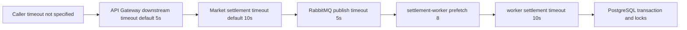

# Performance and Capacity View

## View Metadata

| Field | Value |
| --- | --- |
| View status | Canonical |
| Last reviewed | 2026-06-23 |
| Governing viewpoint | VP-08 Performance And Capacity |
| Evidence baseline | Repository commit `fe5c6af`; architecture file hashes are recorded in `18-evidence-manifest.md` |

Governed by: [VP-08 Performance And Capacity Viewpoint](./02-viewpoints.md#vp-08-performance-and-capacity-viewpoint)

## Concerns Addressed

This view addresses CON-12, CON-14, CON-15, CON-23, CON-25, and CON-27.

## Performance Model

The current trade path is caller-synchronous but internally crosses multiple
services, RabbitMQ, and a PostgreSQL transaction. The architecture has timeout
configuration but no committed SLOs or measured capacity baseline.

## Timeout And Queueing Budget

Model ID: `MODEL-PERF-01`; view component ID: `VC-PERF-01`.

| Segment | Current evidence | Current value | Current gap | Risk |
| --- | --- | --- | --- | --- |
| Caller to API Gateway | No caller timeout is defined in the repository. | Unknown | No repository-level caller timeout contract. | Upstream may time out before internal settlement completes. |
| API Gateway to Market | `API_GATEWAY_DOWNSTREAM_TIMEOUT` default. | `5s` | Current default is shorter than Market settlement timeout. | Gateway may time out while Market continues. |
| Market to settlement transport | `MARKET_SETTLEMENT_REQUEST_TIMEOUT` default. | `10s` | No approved end-to-end contract ties this to caller timeout. | Caller-visible latency includes broker, worker, settlement, and DB time. |
| RabbitMQ publish | `RABBITMQ_PUBLISH_TIMEOUT` configured in Kubernetes base. | `5s` | Publish/retry budget is not modeled end to end. | Publish confirmation failure can make outcome ambiguous if broker accepted the command but reply is lost. |
| settlement-worker to trade-settlement | `SETTLEMENT_WORKER_REQUEST_TIMEOUT` configured in Kubernetes base. | `10s` | Coordination with upstream wait strategy is not modeled. | Worker timeout can occur while database transaction outcome is unknown to Market. |
| Database transaction | No statement timeout or lock timeout is modeled. | Unknown | No statement/lock budget is recorded. | Lock contention can dominate latency. |

## SLO And Measurement Register

| Measure | Current value | Current measurement gap | Evidence status |
| --- | --- | --- | --- |
| API Gateway request latency SLO | Not measured | No p95/p99 latency is defined for issue, accept, cancel, or replay paths. | Gap recorded |
| Settlement end-to-end latency | Not measured | No budget from Market publish to settlement reply is recorded. | Gap recorded |
| RabbitMQ queue depth threshold | Not measured | No warning/critical threshold for command queue or DLQ is recorded. | Gap recorded |
| settlement-worker consumer lag | Not measured | No max sustained lag or scale-out rule is recorded. | Gap recorded |
| PostgreSQL lock wait budget | Not measured | No acceptable lock wait or transaction duration is recorded. | Gap recorded |
| Throughput baseline | Not measured | No load test result for issue, accept, cancel, replay, or failure paths is recorded. | Gap recorded |

## Bottleneck And Backpressure Table

| Bottleneck | Backpressure signal | Current control | Gap |
| --- | --- | --- | --- |
| API Gateway request concurrency | HTTP latency and error rate | Kubernetes scaling and resource limits where configured. | No request concurrency target. |
| Market validation reads | PostgreSQL query latency | Market readiness checks PostgreSQL ping. | No query latency SLO or connection pool sizing model. |
| RabbitMQ command queue | Queue depth and publish latency | Quorum command queue and prefetch config. | No alert threshold or saturation policy. |
| settlement-worker consumers | Consumer lag and worker readiness | Prefetch `8`; horizontal scaling possible through Deployment/HPA. | No max safe worker count or ordering analysis. |
| trade-settlement execution | RPC latency and DB transaction time | Single mutation owner and PostgreSQL transaction. | No lock-contention budget. |
| PostgreSQL ledgers | Storage growth, index growth, write latency | Append-only ledger schema and indexes. | No partitioning, retention, or vacuum policy. |

## Capacity Assumptions

| Assumption | Status |
| --- | --- |
| Horizontal scaling of API Gateway and Market is safe because they are stateless with respect to business mutation. | Reasonable, but load-tested capacity is not documented. |
| Horizontal scaling of settlement-worker is safe if idempotency and database locks prevent duplicate mutation. | Reasonable, but queue/lock contention tests are not documented. |
| Horizontal scaling of trade-settlement depends on PostgreSQL transaction correctness and lock behavior. | Load and contention test results are not documented. |
| RabbitMQ quorum queues improve durability at a latency cost. | Accepted architecture trade-off; no benchmark recorded. |
| PostgreSQL is the primary capacity limiter for settlement writes. | Likely; no measured baseline recorded. |

## Performance Assertions

| Assertion | Enforcement tag | Evidence or gap |
| --- | --- | --- |
| The architecture has configurable timeouts across API Gateway, Market, messaging, and worker. | Enforced by configuration | Config files define defaults and Kubernetes values. |
| The architecture has no committed latency or throughput SLO. | Gap recorded | No SLO document or benchmark exists. |
| Backpressure signals are listed but dashboards/alerts are not implemented here. | Gap recorded | Observability view lists queue depth, worker lag, error rate, and database latency signals. |
| Capacity claims have no live load-test evidence in this repository update. | Gap recorded | Validation matrix records no load-test result. |

## Concern Satisfaction

| Concern | How this view satisfies it |
| --- | --- |
| CON-12 | Shows readiness-related bottlenecks and their limits. |
| CON-14 | Models timeout and failure visibility risks. |
| CON-15 | Identifies ambiguous outcomes from synchronous-over-asynchronous execution. |
| CON-23 | Lists runtime services and capacity-sensitive dependencies. |
| CON-25 | Defines performance signals that probes/telemetry should expose. |
| CON-27 | Identifies infrastructure cost and capacity drivers. |
