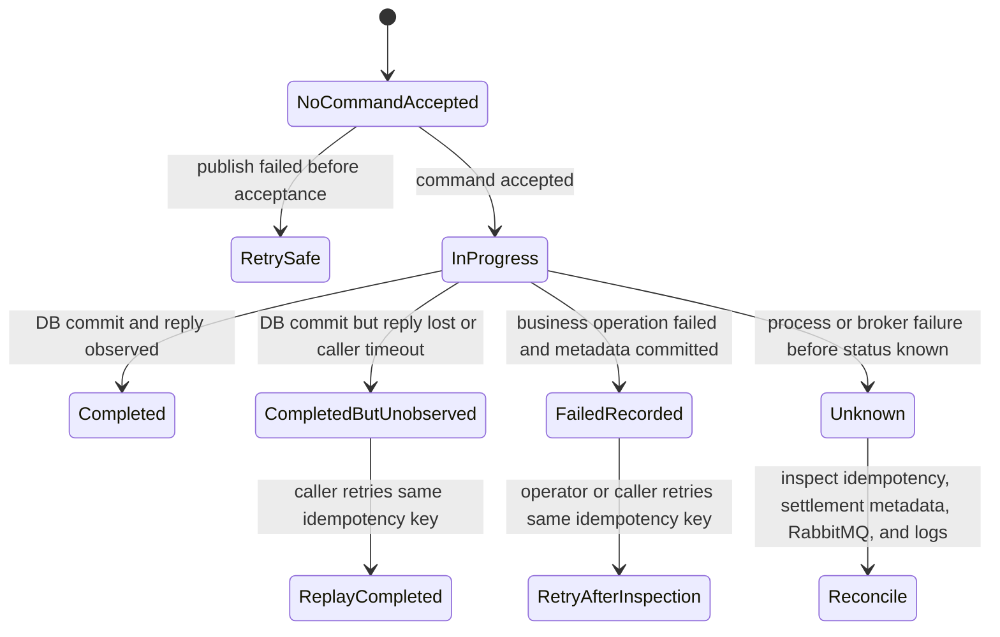

# Resilience and Recovery View

## View Metadata

| Field | Value |
| --- | --- |
| View status | Canonical |
| Last reviewed | 2026-06-23 |
| Governing viewpoint | VP-09 Resilience And Recovery |
| Evidence baseline | Repository commit `fe5c6af`; architecture file hashes are recorded in `18-evidence-manifest.md` |

Governed by: [VP-09 Resilience And Recovery Viewpoint](./02-viewpoints.md#vp-09-resilience-and-recovery-viewpoint)

## Concerns Addressed

This view addresses CON-07, CON-10, CON-13, CON-14, CON-15, CON-24, and
CON-33.

## Recovery State Model



## Ambiguous Outcome Matrix

Model ID: `MODEL-RES-01`; view component ID: `VC-RES-01`.

| Failure point | Durable state may be | Caller-visible result | Current documented recovery path |
| --- | --- | --- | --- |
| Market publish fails before broker acceptance | No command accepted | Error | Retry with same idempotency key. |
| Market publish succeeds but reply times out | `COMPLETED`, `FAILED`, or `IN_PROGRESS` | Timeout | Query/retry with same idempotency key; inspect settlement metadata. |
| Worker crashes before calling settlement | Command remains queued or is redelivered depending broker state. | Timeout | RabbitMQ consumer recovery; monitor queue depth. |
| Worker crashes after settlement commit before reply | `COMPLETED` but unobserved by caller. | Timeout | Replay same idempotency key to obtain completed outcome. |
| trade-settlement operation fails | `FAILED` metadata with business rollback if failure metadata commits. | Settlement error or timeout | Inspect failed batch/step and retry only if safe. |
| PostgreSQL unavailable | No commit or unknown if failure happens during commit. | Error or timeout | Use idempotency record and DB logs to determine final state. |
| DLQ receives command | Command is out of normal processing path. | Timeout or error | DLQ inspection and redrive/discard procedure. |

## Dead-Letter Queue Operations

| DLQ operation | Documented owner | Documented procedure | Current status |
| --- | --- | --- | --- |
| Alert on non-zero sustained DLQ depth | SRE/on-call | Alert on sustained depth above threshold defined in Observability view. | Gap recorded; alert rule not implemented |
| Inspect message headers and payload | SRE with settlement owner | Use RabbitMQ management UI/CLI to inspect message ID, correlation ID, routing key, idempotency key, and payload class. | Procedure documented; tooling not verified |
| Determine whether business mutation happened | Settlement/data integrity owner | Query idempotency and settlement metadata before redrive or discard. | Procedure documented; not automated |
| Redrive safe messages | SRE with settlement owner approval | Redrive only when idempotency state proves no completed duplicate or when replay is known safe. | Gap recorded; no redrive tool or implemented approval workflow |
| Discard poison messages | SRE with security/data approval | Discard only after failure reason, payload, and business mutation state are recorded. | Gap recorded; no implemented approval workflow |
| Record incident | On-call | Record incident ID, message IDs, idempotency keys, decision, approver, and follow-up risk/action. | Governance rule; not automated |

## Recovery Runbooks

These are documented operator procedures. They are not implemented as scripts
or enforced approval workflows in the repository.

| Runbook | Trigger | Steps | Approval note | Current status |
| --- | --- | --- | --- | --- |
| RB-001 Ambiguous timeout reconciliation | Caller receives timeout or downstream unavailable after command submission. | Retry same command with same idempotency key; query `idempotency_record`; inspect `settlement_batch`, `request_attempt`, `settlement_step`; inspect Market/worker/settlement logs by idempotency key and RabbitMQ correlation ID. | On-call may perform read-only checks; manual mutation decisions are not automated. | Documented, not automated |
| RB-002 DLQ inspection | DLQ depth is non-zero or poison message suspected. | Inspect message headers/payload; extract idempotency key; run RB-001; classify as safe redrive, poison discard, or manual investigation. | SRE plus settlement owner. | Documented, no redrive tool |
| RB-003 Failed settlement analysis | Settlement response or metadata indicates failed batch. | Query failed batch/attempt/steps; inspect failure reason; verify business savepoint rollback; decide whether same-key retry is safe. | Settlement/data owner. | Documented, not automated |
| RB-004 Database restore | PostgreSQL data loss, corruption, or failed migration. | Stop writers, identify restore point, restore backup/PITR, verify migrations, run integrity checks, resume services. | Database owner plus incident commander. | Not defined in repository |
| RB-005 Placeholder deployment rejection | Production overlay contains example values or zero digests. | Fail release, identify placeholder source, patch through approved release input, rerender manifests. | CI/release maintainer. | Not implemented as a repository gate |

## Operational Query Templates

The exact schema and query access path have not been verified in a target
environment during this documentation update. These templates describe the
current tables that operators would inspect.

```sql
-- Find idempotency state for an ambiguous request.
SELECT idempotency_key, request_fingerprint, idempotency_state,
       result_settlement_batch_id, created_at, completed_at,
       failure_code, failure_message
FROM idempotency_record
WHERE idempotency_key = $1;

-- Inspect settlement attempts and batches for a key.
SELECT ra.attempt_number, ra.attempt_state, sb.settlement_batch_id,
       sb.batch_state, sb.failure_code, sb.failure_message
FROM request_attempt ra
LEFT JOIN settlement_batch sb
  ON sb.idempotency_key = ra.idempotency_key
WHERE ra.idempotency_key = $1
ORDER BY ra.attempt_number;

-- Inspect failed or incomplete steps for a settlement batch.
SELECT step_index, step_kind, step_state, failure_code, failure_message
FROM settlement_step
WHERE settlement_batch_id = $1
ORDER BY step_index;
```

## RTO/RPO And Backup Assumptions

| Area | Current architecture position | Gap |
| --- | --- | --- |
| PostgreSQL RPO | No explicit RPO in repository. | No backup and point-in-time recovery target is recorded. |
| PostgreSQL RTO | No explicit RTO in repository. | No restore time target or test schedule is recorded. |
| RabbitMQ command durability | Quorum queues are configured for command and dead-letter queues. | Broker backup/recovery and quorum sizing are not documented. |
| Service recovery | Kubernetes restarts pods; Compose restarts depend on local use. | No incident runbook or chaos test result recorded. |
| Idempotency replay | Completed keys can replay; failed keys can be reset/retried by executor behavior. | The documented procedure is this view; no product outcome-query API exists. |

## Reconciliation Procedure

When a caller receives a timeout or ambiguous downstream error:

1. Reuse the same idempotency key and request fingerprint for any retry.
2. Inspect `idempotency_record` for `COMPLETED`, `FAILED`, or `IN_PROGRESS`.
3. If completed, return or recover the recorded settlement batch result.
4. If failed, inspect `request_attempt`, `settlement_batch`, and
   `settlement_step` failure fields before retry.
5. If in progress beyond expected timeout, inspect RabbitMQ queue state,
   settlement-worker logs, and trade-settlement logs.
6. Do not issue a semantically duplicate trade command with a new idempotency key
   until the first outcome is resolved.

## Resilience Assertions

| Assertion | Enforcement tag | Evidence or gap |
| --- | --- | --- |
| Idempotency is the primary recovery mechanism for ambiguous caller outcomes. | Enforced by settlement executor | Requires client discipline and operator procedure. |
| DLQ existence is not enough for recovery. | Gap recorded | Alerting, redrive, and discard runbooks are not implemented in docs. |
| PostgreSQL backup/restore policy is not defined in the repository. | Gap recorded | No RTO/RPO is defined. |
| Failed metadata is designed to preserve diagnosis after business rollback. | Enforced by settlement executor design | Live failure validation not run in this doc update. |
