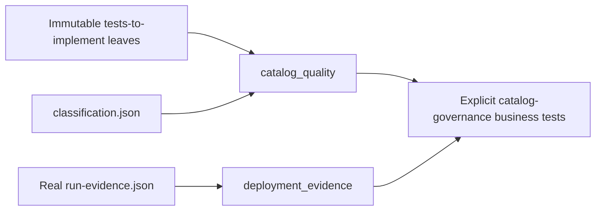

# Reusable oracle dependency graph

`catalog_quality` receives catalog records and bytes from the explicit test setup; it does not load or implement infrastructure. `deployment_evidence` independently rejects empty, controller-only, or control-plane-only scenario evidence before a business oracle is evaluated.
